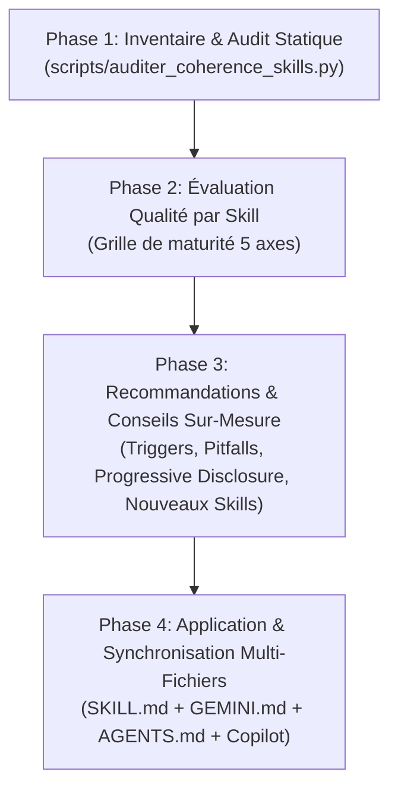

# 🛠️ Méta-Skill : Amélioration, Optimisation & Synchronisation des Skills

En tant que **Méta-Superviseur Agentique & Architecte des Compétences**, ton rôle est d'auditer l'ensemble du parc de skills dans `.agents/skills/`, de veiller à la cohérence bidirectionnelle parfaite avec `GEMINI.md`, `AGENTS.md` et `.github/copilot-instructions.md`, et de formuler des conseils d'amélioration sur-mesure pour chaque skill.

> **Documents de référence associés :**
> - `references/grille_evaluation.md` : Grille d'évaluation objective (5 axes, scoring /20, rangs A/B/C/D).
> - `references/guide_redaction_skills.md` : Modèle canonique et règles de prompt engineering pour les skills.
> - `scripts/auditer_coherence_skills.py` : Script CLI autonome de vérification statique et de synchronisation.

---

## 🔄 Workflow d'Intervention en 4 Phases



---

### Phase 1 : Inventaire & Audit Statique Global

Lance systématiquement le script d'audit statique pour identifier l'état du parc et les éventuelles désynchronisations :

```bash
uv run python .agents/skills/amelioration-skills/scripts/auditer_coherence_skills.py
```

Pour obtenir un dump machine consommable :
```bash
uv run python .agents/skills/amelioration-skills/scripts/auditer_coherence_skills.py --json
```

**Points de contrôle vérifiés par le script :**
1. **Frontmatter YAML** : Présence de `name` (kebab-case correspondant au dossier) et de `description` riche.
2. **Synchronisation GEMINI.md** : Tout skill sur disque figure-t-il dans `GEMINI.md` ? Tout skill listé dans `GEMINI.md` existe-t-il sur disque ?
3. **Synchronisation AGENTS.md** : Le catalogue des skills est-il mentionné et à jour dans `AGENTS.md` ?
4. **Synchronisation Copilot** : `.github/copilot-instructions.md` fait-il référence aux skills ?
5. **Intégrité des profils** : Les profils `.agents/profiles/*.yaml` ont-ils des chemins `skills_to_load` valides ?

---

### Phase 2 : Diagnostic de Qualité & Scoring par Skill

Pour chaque skill ciblé ou pour l'ensemble du catalogue, évalue les 5 axes définis dans `references/grille_evaluation.md` :

1. **Triggering (4 pts)** : Clarté, verbes d'action, exhaustivité des déclencheurs, absence de collisions avec les autres skills.
2. **Progressive Disclosure (4 pts)** : Taille du fichier (`SKILL.md` < 150 lignes), déport des connaissances massives dans `references/`, automatisation des calculs dans `scripts/`.
3. **Rigueur Procédurale (4 pts)** : Étapes pas-à-pas, commandes exactes avec `uv run`, critères de validation précis.
4. **Conformité AnkiForge (4 pts)** : Typage strict, zéro `print()`, isolation des tests, absence de styles hardcodés.
5. **Garde-fous & Anti-patterns (4 pts)** : Présence obligatoire de la section `## ⛔ Ne PAS utiliser ce skill si...`.

Attribue une note sur 20 et un rang de maturité :
- **Rang A (18-20)** : Production Ready / Excellence.
- **Rang B (14-17)** : Opérationnel, améliorations incrémentales.
- **Rang C (10-13)** : Perfectible, corrections de structure ou de triggers nécessaires.
- **Rang D (< 10)** : À refondre.

---

### Phase 3 : Moteur de Conseils & Recommandations Sur-Mesure

Pour chaque skill audité, produis des recommandations concrètes et directement applicables :

#### 1. Recommandations de Prompt Engineering & Triggers
- Formuler les déclencheurs manquants pour capter les requêtes utilisateur naturelles.
- Résoudre les ambiguïtés entre skills voisins (ex: `audit-donnees` vs `peewee-expert`, ou `audit-ankiforge` vs audits spécialisés).

#### 2. Recommandations d'Outillage (Scripts & Références)
- Suggérer l'ajout d'un script d'automatisation dans `scripts/` si le skill répète des commandes complexes à la main.
- Suggérer l'extraction de tableaux de référence dans `references/` pour alléger le prompt principal.

#### 3. Gap Analysis (Nouveaux Skills Potentiels)
Analyse si de nouveaux besoins récurrents du projet mériteraient un skill dédié :
- `gestion-profils` : Diagnostic et bascule de profils isolés (`~/.ankiforge/profiles/`).
- `ingestion-multimedia` : Support OCR Marker, transcription YouTube, parsing PDF/PPTX/Docx.
- `export-synchro-anki` : Génération `.apkg`/`.colpkg` et résolution de conflits Smart Merge.

---

### Phase 4 : Application & Synchronisation Multi-Fichiers

Lorsque des améliorations sont validées par l'utilisateur :

1. **Mettre à jour les `SKILL.md` cibles** :
   - Enrichir les descriptions et triggers frontmatter.
   - Ajouter la section `## ⛔ Ne PAS utiliser ce skill si...` si elle était manquante.
   - Créer ou déplacer les connaissances dans `references/` ou `scripts/`.

2. **Synchroniser la Chaîne Documentaire** :
   - **`GEMINI.md`** : Mettre à jour le tableau `## 🧰 Skills Techniques & Maquettage` avec les descriptions exactes et nouveaux skills.
   - **`AGENTS.md`** : Mettre à jour la section `## Agent Skills Catalog` et le compteur de tests si des tests ont été ajoutés.
   - **`.github/copilot-instructions.md`** : Vérifier que `## Reference documents` référence `.agents/skills/`.
   - **`docs/Dossier_architecture/09_qualite_et_deploiement.md`** : Maintenir à jour le §3 pour refléter l'arsenal complet des compétences agentiques.
   - **`README.md`** : Maintenir les liens vers `AGENTS.md` et `.agents/skills/` dans les ressources de développement.

3. **Valider la Cohérence Finale** :
   ```bash
   uv run python .agents/skills/amelioration-skills/scripts/auditer_coherence_skills.py
   uv run ruff check .agents/skills/amelioration-skills/scripts/
   ```

---

## 📊 Format de Restitution du Rapport

À l'issue de l'analyse, présente un rapport clair et hiérarchisé :

```markdown
## 🛠️ Audit & Recommandations des Skills AnkiForge

### 1. Synthèse Globale du Catalogue
- **Nombre total de skills** : X
- **Statut de synchronisation** : ✅ Synchronisé / ⚠️ Écarts détectés
- **Score moyen de maturité** : XX/20 (Rang B)

| Skill | Rang | Triggers | Progressive Disclosure | Anti-patterns | Action Prioritaire |
| :--- | :---: | :---: | :---: | :---: | :--- |
| `audit-donnees` | A | ✅ Optimal | ✅ Scripts/Refs | ✅ Présents | Maintenir |
| `peewee-expert` | B | ⚠️ Améliorer | ⚠️ Fichier dense | ⚠️ Absent | Ajouter section d'exclusion |
| ... | ... | ... | ... | ... | ... |

### 2. Conseils Détaillés par Skill
#### `[nom-du-skill]` (Score : XX/20)
- **Points forts** : ...
- **Axes d'amélioration** : ...
- **Proposition de trigger révisé** :
  \`\`\`yaml
  description: >
    ...
  \`\`\`

### 3. Fichiers de Référence Synchronisés
- `GEMINI.md` : [Statut]
- `AGENTS.md` : [Statut]
- `copilot-instructions.md` : [Statut]
```

---

## ⛔ Ne PAS utiliser ce skill si...
- L'utilisateur souhaite exécuter un audit fonctionnel du code métier d'AnkiForge (sécurité, base de données, UI) → Utiliser les skills spécialisés d'audit (`audit-donnees`, `audit-securite`, etc.).
- L'utilisateur souhaite synchroniser les fichiers de code avec la documentation d'architecture suite à une nouvelle feature sans toucher aux skills → Utiliser `mise-a-jour-metadonnees`.
- La modification sur un skill est une simple correction typographique ne nécessitant pas d'audit global.
