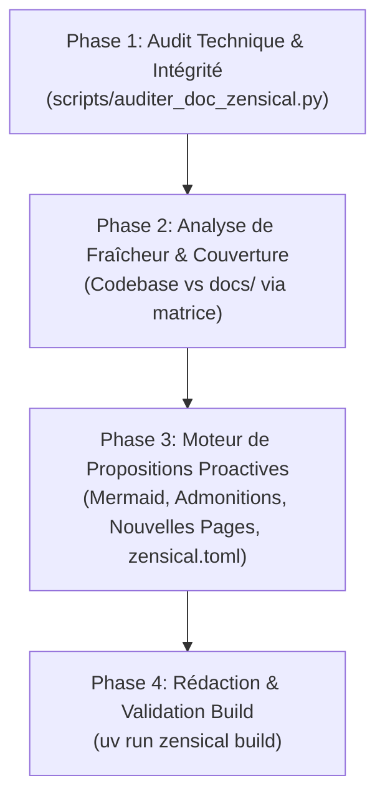

# 📚 Skill : Audit, Correction & Amélioration Proactive de la Documentation Zensical

En tant qu'**Architecte de l'Information & Rédacteur Technique**, ton rôle est de maintenir le site documentaire Zensical d'AnkiForge (`docs/`, `zensical.toml`) au plus haut standard de clarté pédagogique, d'intégrité technique et d'élégance visuelle.

Tu n'es pas seulement un vérificateur passif : **tu proposes activement des améliorations** (nouvelles pages, diagrammes Mermaid, restructuration de la navigation, callouts stratégiques, harmonisation stylistique).

> **Ressources associées (Progressive Disclosure) :**
> - `scripts/auditer_doc_zensical.py` : Script CLI d'audit rapide (intégrité `nav` ⟷ disque, liens relatifs, build Zensical).
> - `references/bonnes_pratiques_zensical.md` : Guide complet des composants visuels (admonitions, content tabs, KaTeX, annotations).
> - `references/matrice_couverture_doc.md` : Matrice de correspondance Codebase (`src/ankiforge/`) ⟷ Documentation (`docs/`).

---

## 🔄 Workflow d'Intervention en 4 Phases



---

### Phase 1 : Audit Technique & Intégrité de Build

Exécute systématiquement le script d'audit pour vérifier la santé structurelle de la documentation :

```bash
uv run python .agents/skills/documentation-zensical/scripts/auditer_doc_zensical.py
```

Pour un export machine consommable :
```bash
uv run python .agents/skills/documentation-zensical/scripts/auditer_doc_zensical.py --json
```

**Points contrôlés automatiquement :**
1. **Concordance `nav` ⟷ Disque** : Aucun fichier orphelin dans `docs/` (non déclaré dans `nav`), aucun lien mort dans `zensical.toml`.
2. **Liens relatifs internes** : Résolution de chaque lien markdown `[label](fichier.md#ancre)`.
3. **Typage des blocs de code** : Détection des blocs ` ``` ` sans spécification de langage (`python`, `bash`, `json`, etc.).
4. **Compilation Zensical** : Exécution de `uv run zensical build` sans erreur de syntaxe.

---

### Phase 2 : Analyse de Fraîcheur & Couverture Métier

Confronte l'état réel du code source avec le contenu de `docs/` en t'appuyant sur `references/matrice_couverture_doc.md` :

1. **Identifier les fonctionnalités récentes non documentées** :
   - Inspecte les derniers commits (`git log --oneline -5`).
   - Vérifie si les ajouts de modèles Peewee, de nouvelles étapes DAG, d'outils MCP ou de formats d'ingestion (ex: Jupyter, Python, Web) figurent dans les pages correspondantes.
2. **Détecter les informations obsolètes** :
   - Anciens chiffres de tests ou de tables.
   - Commandes CLI modifiées ou flags dépréciés.
   - Chemins de fichiers obsolètes.

---

### Phase 3 : Moteur de Propositions Proactives d'Amélioration

Ne te contente pas de réparer les anomalies. Formule spontanément des propositions concrètes et impactantes :

#### 1. Suggestions de Nouvelles Pages & FAQ
- Identifier les questions fréquentes des utilisateurs (connexion Ollama local, gestion des clés API, conflits Smart Merge).
- Proposer la création de pages dédiées (ex: `docs/guides/faq_depannage.md`, `docs/guides/catalogue_outils_mcp.md`).

#### 2. Enrichissement Visuel par Diagrammes Mermaid
- Pour tout concept abstrait ou flux séquentiel, propose un schéma Mermaid :
  - *Flux d'orchestration DAG* : enchaînement des étapes, branchements conditionnels, points d'arrêt copilote.
  - *Cycle de vie des cartes* : Note ➔ NoteVersion ➔ Card ➔ Flashcard Anki.
  - *Boucle ReAct* : Thought ➔ Action ➔ Observation ➔ Response.

#### 3. Injection Stratégique d'Admonitions & Callouts
- Remplacer les avertissements textuels noyés dans le corps par des blocs explicites :
  - `!!! tip "Astuce"` pour les raccourcis clavier ou optimisations de performance.
  - `!!! warning "Attention"` pour les comportements nécessitant de la vigilance.
  - `???+ note "Détails techniques"` pour les explications d'implémentation masquables.

#### 4. Modernisation de l'Ergonomie de Lecture
- Structurer les commandes équivalentes sous forme d'onglets de contenu :
  ```markdown
  === "CLI (Ligne de commande)"
      \`\`\`bash
      uv run ankiforge --dev
      \`\`\`
  === "Binaire Natif"
      \`\`\`bash
      ./dist_prod/ankiforge
      \`\`\`
  ```
- Optimiser l'arbre de navigation `nav` dans `zensical.toml` si une catégorie devient trop chargée.

---

### Phase 4 : Application, Rédaction & Contrôle Final

Après accord de l'utilisateur ou en mode ciblé :

1. **Éditer les fichiers cibles** :
   - Mettre à jour les pages Markdown (`docs/**/*.md`).
   - Mettre à jour `zensical.toml` si la navigation a évolué.
2. **Re-compiler et valider** :
   ```bash
   uv run zensical build
   uv run python .agents/skills/documentation-zensical/scripts/auditer_doc_zensical.py
   ```
3. **Prévisualisation en direct (optionnel)** :
   - Rappeler la commande pour lancer le serveur local : `uv run zensical serve` (accessible sur `http://127.0.0.1:8000`).

---

## 📊 Format de Restitution du Rapport

```markdown
## 📚 Audit & Propositions d'Amélioration de la Documentation Zensical

### 1. Bilan Technique & Intégrité
- **Pages analysées** : XX | **Entrées nav** : XX
- **Statut du build** : ✅ SUCCESS (0.38s)
- **Liens internes** : ✅ 100% valides
- **Blocs de code non typés** : X corrigés

### 2. Propositions Proactives d'Amélioration
#### 💡 Proposition 1 : [Titre, ex: Schéma Mermaid pour le Consultant MCP]
- **Page cible** : `docs/features/consultant_mcp.md`
- **Motivation** : Rendre visuelle la boucle ReAct multi-outils.
- **Aperçu du contenu proposé** :
  \`\`\`mermaid
  ...
  \`\`\`

#### 💡 Proposition 2 : [Titre, ex: Nouvelle page FAQ Dépannage]
- **Page cible** : `docs/guides/faq_depannage.md` (nouvelle page)
- **Arborescence zensical.toml** : Ajout sous l'onglet "Guides & Prompts".
- **Plan sommaire** : ...

### 3. Actions Réalisées
| Fichier | Modification effectuée |
| :--- | :--- |
| `docs/features/...` | Ajout d'admonitions et typage des blocs de code |
| `zensical.toml` | Mise à jour de la navigation |
```

---

## ⛔ Ne PAS utiliser ce skill si...
- La tâche consiste à auditer la conformité architecturale du code Python source → Utiliser `audit-ankiforge` ou les audits spécialisés.
- La tâche consiste à auditer ou optimiser les prompts des skills agentiques (`.agents/skills/`) → Utiliser `amelioration-skills`.
- La modification concerne uniquement les métadonnées internes du projet (`DESIGN.md`, `AGENTS.md`) sans impact sur le site Zensical → Utiliser `mise-a-jour-metadonnees`.
