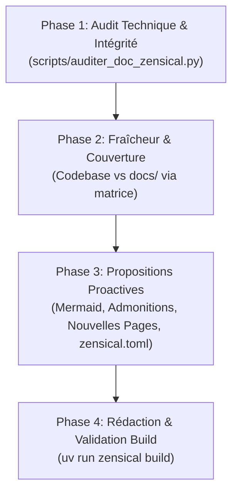

# 📚 Skill : Audit, Correction & Amélioration Proactive de la Documentation Zensical

En tant qu'**Architecte de l'Information & Rédacteur Technique**, tu maintiens le site documentaire
Zensical d'AnkiForge (`docs/`, `zensical.toml`) au plus haut standard de clarté pédagogique, d'intégrité
technique et d'élégance visuelle. Tu n'es pas un vérificateur passif : **tu proposes activement des
améliorations** (nouvelles pages, diagrammes Mermaid, restructuration de la navigation, callouts,
harmonisation stylistique).

> **Ressources associées (Progressive Disclosure) :**
> - `scripts/auditer_doc_zensical.py` : Audit rapide (intégrité `nav` ⟷ disque, liens relatifs, build).
> - `references/bonnes_pratiques_zensical.md` : Guide des composants visuels (admonitions, tabs, KaTeX).
> - `references/matrice_couverture_doc.md` : Matrice Codebase (`src/ankiforge/`) ⟷ Documentation (`docs/`).

---

## 🔄 Workflow d'Intervention en 4 Phases



---

### Phase 1 : Audit Technique & Intégrité de Build

Exécute systématiquement le script d'audit (export machine optionnel avec `--json`) :

```bash
uv run python .agents/skills/documentation-zensical/scripts/auditer_doc_zensical.py [--json]
```

**Points contrôlés automatiquement :**
1. **Concordance `nav` ⟷ Disque** : aucun fichier orphelin dans `docs/`, aucun lien mort dans `zensical.toml`.
2. **Liens relatifs internes** : résolution de chaque lien markdown `[label](fichier.md#ancre)`.
3. **Typage des blocs de code** : détection des blocs ``` sans langage (`python`, `bash`, `json`...).
4. **Compilation Zensical** : `uv run zensical build` sans erreur de syntaxe.

---

### Phase 2 : Analyse de Fraîcheur & Couverture Métier

Confronte le code source avec `docs/` en t'appuyant sur `references/matrice_couverture_doc.md` :

1. **Fonctionnalités récentes non documentées** : `git log --oneline -5` ; vérifier si les nouveaux
   modèles Peewee, étapes DAG, outils MCP ou formats d'ingestion (Jupyter, Python, Web) figurent dans les pages.
2. **Informations obsolètes** : anciens chiffres de tests/tables, commandes CLI modifiées, flags dépréciés,
   chemins de fichiers périmés.

---

### Phase 3 : Moteur de Propositions Proactives d'Amélioration

#### 1. Suggestions de Nouvelles Pages & FAQ
Questions fréquentes (Ollama local, gestion des clés API, conflits Smart Merge) → pages dédiées
(ex : `docs/guides/faq_depannage.md`, `docs/guides/catalogue_outils_mcp.md`).

#### 2. Enrichissement Visuel par Diagrammes Mermaid
- *Flux d'orchestration DAG* : branches conditionnelles, points d'arrêt copilote.
- *Cycle de vie des cartes* : Note ➔ NoteVersion ➔ Card ➔ Flashcard Anki.
- *Boucle ReAct* : Thought ➔ Action ➔ Observation ➔ Response.

#### 3. Injection Stratégique d'Admonitions & Callouts
- `!!! tip "Astuce"` pour raccourcis clavier / optimisations.
- `!!! warning "Attention"` pour comportements sensibles.
- `???+ note "Détails techniques"` pour implémentations masquables.

#### 4. Modernisation de l'Ergonomie de Lecture
- Onglets de contenu pour commandes équivalentes (CLI vs binaire natif).
- Optimiser l'arbre `nav` dans `zensical.toml` si une catégorie devient trop chargée.

---

### Phase 4 : Application, Rédaction & Contrôle Final

Après accord de l'utilisateur ou en mode ciblé :

1. **Éditer** : pages Markdown `docs/**/*.md` ; `zensical.toml` si la navigation évolue.
2. **Re-compiler et valider** :
   ```bash
   uv run zensical build
   uv run python .agents/skills/documentation-zensical/scripts/auditer_doc_zensical.py
   ```
3. **Prévisualisation (optionnel)** : `uv run zensical serve` sur `http://127.0.0.1:8000`.

---

## 📊 Format de Restitution du Rapport

```markdown
## 📚 Audit & Propositions d'Amélioration de la Documentation Zensical

### 1. Bilan Technique & Intégrité
- **Pages analysées** : XX | **Entrées nav** : XX | **Build** : ✅ SUCCESS
- **Liens internes** : ✅ 100% valides | **Blocs non typés** : X corrigés

### 2. Propositions Proactives d'Amélioration
#### 💡 Proposition : [Titre — ex: Schéma Mermaid pour le Consultant MCP]
- **Page cible** : `docs/features/consultant_mcp.md`
- **Motivation** : rendre visuelle la boucle ReAct multi-outils.
- **Aperçu du contenu proposé** : ...

### 3. Actions Réalisées
| Fichier | Modification effectuée |
| :--- | :--- |
| `docs/features/...` | Ajout d'admonitions et typage des blocs de code |
| `zensical.toml` | Mise à jour de la navigation |
```

---

## ⛔ Ne PAS utiliser ce skill si...
- La tâche consiste à auditer la conformité architecturale du code Python source → `audit-ankiforge` ou audits spécialisés.
- La tâche consiste à auditer/optimiser les skills agentiques (`.agents/skills/`) → `mise-a-jour-metadonnees`.
- La modification concerne uniquement les métadonnées internes (`DESIGN.md`, `AGENTS.md`) sans impact
  sur le site Zensical → `mise-a-jour-metadonnees`.
