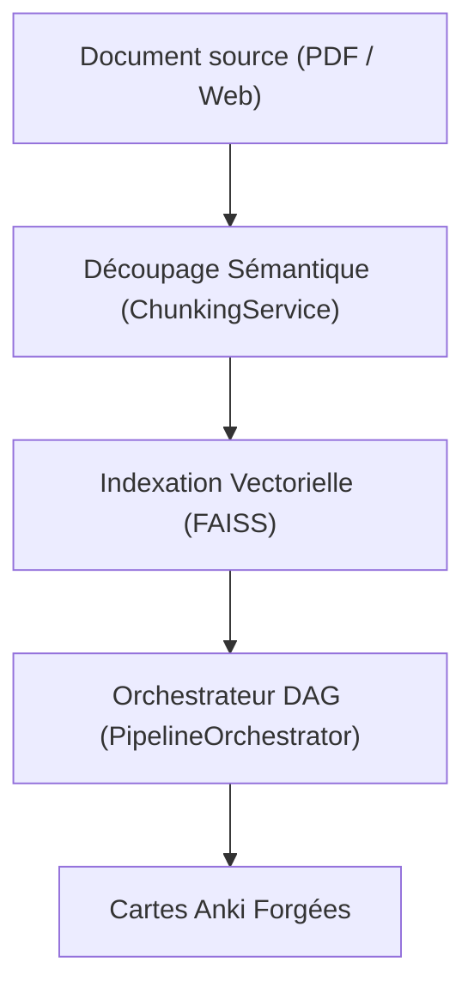
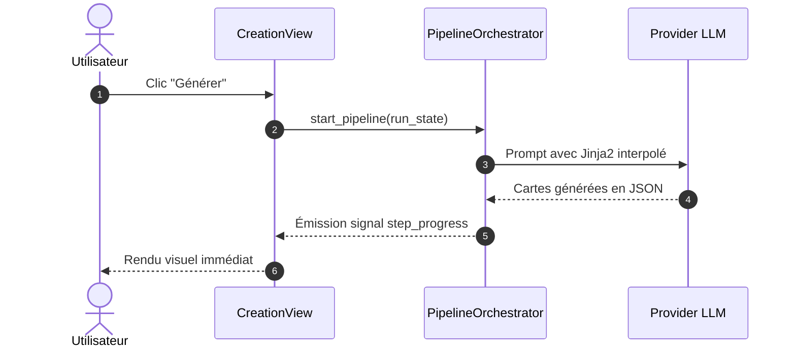

# Bonnes Pratiques & Composants Graphiques Zensical — AnkiForge 🎨

Ce guide rassemble la syntaxe exacte et les composants visuels pris en charge par le moteur de rendu Zensical d'AnkiForge (compatible Material for MkDocs).

---

## 1. Blocs d'Avertissement & Callouts (*Admonitions*)

Zensical prend en charge les admonitions natives avec titres personnalisés et versions repliables.

### Syntaxe Standard
```markdown
!!! note "Note importante"
    Contenu indenté de 4 espaces décrivant le point d'attention.

!!! tip "Astuce de productivité"
    Raccourci clavier ou bonne pratique recommandée.

!!! warning "Avertissement"
    Risque potentiel ou comportement nécessitant de la prudence.

!!! danger "Action critique"
    Opération irréversible ou risque de perte de données.

!!! example "Exemple concret"
    Illustration pratique ou extrait de code.
```

### Blocs Repliables (*Details*)
```markdown
??? note "Cliquez pour dérouler les détails techniques"
    Ce contenu est masqué par défaut pour ne pas alourdir la lecture.

???+ tip "Déplié par défaut mais refermable"
    Ce bloc est immédiatement visible mais peut être replié par l'utilisateur.
```

---

## 2. Onglets de Contenu (*Content Tabs*)

Indispensables pour présenter des alternatives équivalentes (ex: commande CLI vs Interface Graphique, ou Python vs Bash).

```markdown
=== "Interface Graphique (PySide6)"
    1. Ouvrez le panneau **Studio de Création**.
    2. Sélectionnez votre modèle de note dans le menu déroulant.
    3. Cliquez sur **Lancer la génération**.

=== "Ligne de Commande (CLI)"
    \`\`\`bash
    uv run ankiforge --dev --smoke-test
    \`\`\`
```

---

## 3. Blocs de Code & Annotations

### Coloration syntaxique & Numéros de ligne
Toujours spécifier l'identifiant de langage (`python`, `bash`, `yaml`, `json`, `markdown`, `html`, `css`, `text`).

```markdown
\`\`\`python title="Exemple d'appel d'outil MCP" linenums="1"
from ankiforge.services.ai.mcp_server import get_deck_stats

stats = get_deck_stats("Médecine::Pharmacologie")
print(f"Cartes totales : {stats.total_cards}")  # (1)
\`\`\`

1. Appel in-process sans surcoût réseau ni latence RPC.
```

---

## 4. Diagrammes Mermaid

Zensical intègre le plugin `superfences` avec rendu vectoriel Mermaid natif.

### Flowchart orienté


### Diagramme de Séquence


---

## 5. Expressions Mathématiques (Arithmatex / KaTeX)

Support natif des formules mathématiques :
- **En ligne** : `$f(x) = \sigma(W \cdot x + b)$`
- **En bloc centré** :
  ```latex
  $$
  S(t) = S_0 \cdot \left(1 + \text{factor} \cdot t\right)^{-d}
  $$
  ```

---

## 6. Boutons et Éléments Interactifs

```markdown
[Télécharger la dernière version](https://github.com/Skyl9/AnkiForge/releases){ .md-button .md-button--primary }
[Consulter le code source](https://github.com/Skyl9/AnkiForge){ .md-button }
```
