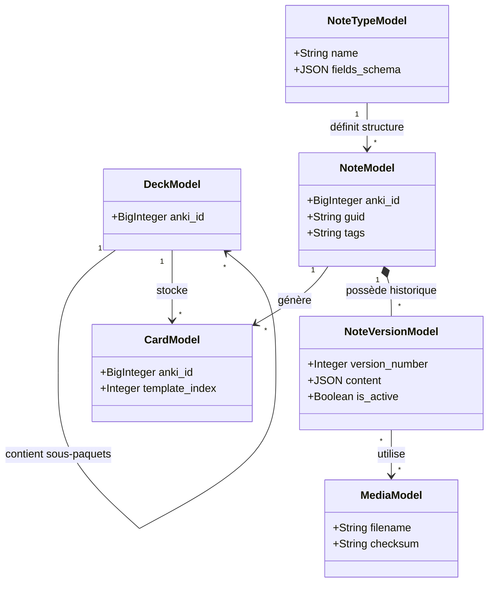

# Modèle de Données et Synchronisation (AnkiForge)

## 1. Modélisation de la Base de Données (Peewee)
AnkiForge reproduit intelligemment la structure relationnelle d'Anki, optimisée pour l'analyse et la forge. La base SQLite locale gérée par `peewee` repose sur les piliers suivants :

* **NoteTypeModel (Les Modèles de Cartes) :** Définit la structure HTML/CSS et les champs disponibles (Recto, Verso, Extra, etc.). C'est l'ADN de la carte.
* **NoteModel (Le Contenu brut) :** Contient les textes, images et formules. Une note est agnostique de son emplacement (paquet).
* **CardModel (Le Rendu) :** Représente l'instanciation physique d'une Note dans un paquet spécifique, avec son historique de révision (bien que cet historique ne soit pas le focus d'AnkiForge).
* **DeckModel & FolderModel :** L'arborescence des paquets.
* **MediaModel :** Stockage des chemins et hash des images/audios pour éviter les doublons lors des exports.

*Le versionnement natif est assuré par des tables `NoteVersionModel`, permettant un historique absolu des modifications.*

## 2. Le Cycle de Synchronisation (Workflow `.apkg`)
AnkiForge fonctionnant de manière isolée ("Air-gapped"), le transfert de données se fait via des archives compressées standard.
1. **Ingestion :** Import d'un `.apkg` (Paquet) ou `.colpkg` (Collection complète). AnkiForge mappe les IDs uniques d'Anki avec ses IDs internes.
2. **Forge :** L'utilisateur modifie, audite, et crée des cartes.
3. **Éjection :** Export d'un nouveau `.apkg` ciblé contenant uniquement les ajouts et les mises à jour, prêt à être double-cliqué pour s'intégrer dans Anki.

## 3. Gestion Intelligente des Conflits (Le Smart Merge)
C'est la fonctionnalité phare pour les Power Users. Lors d'un import, AnkiForge compare la base entrante avec sa base locale. Contrairement à Anki qui écrase brutalement selon la date, AnkiForge déploie un outil de résolution de conflits précis.

### A. Critères stricts de déclenchement d'un conflit
L'application ne lève une alerte de conflit **que si, et seulement si, le contenu textuel/HTML des champs d'une Note a été modifié des deux côtés**.
* **Ce qui déclenche un conflit :** La modification du texte du Recto, la correction d'une faute de frappe, l'ajout d'une image dans le Verso.
* **Ce qui est ignoré (Pas de conflit) :** 
  * Le déplacement de la carte vers un autre paquet (Deck).
  * La modification des statistiques de révision (Ease factor, intervalles).
  * Ces métadonnées sont fusionnées silencieusement (AnkiForge garde le contenu forgé, mais accepte le nouveau Deck entrant si pertinent).

### B. L'Interface de Résolution (Merge Dialog 3-Panneaux)
Si un vrai conflit de contenu est détecté, l'utilisateur n'est pas bloqué, mais une modale façon "IDE de développement" s'ouvre :
1. **Panneau Gauche (Base Locale Forge) :** Affiche la note telle qu'elle a été travaillée dans AnkiForge.
2. **Panneau Droit (Base Entrante Anki) :** Affiche la note provenant du fichier `.apkg` importé.
3. **Panneau Central (Résultat Fusionné) :** Un éditeur interactif avec mise en évidence des différences (diff highlighting) permettant d'accepter les ajouts de gauche ou de droite, ligne par ligne.

Cette approche garantit qu'**aucune connaissance n'est écrasée par erreur**, tout en rendant le processus indolore si la carte a simplement été déplacée de dossier.
