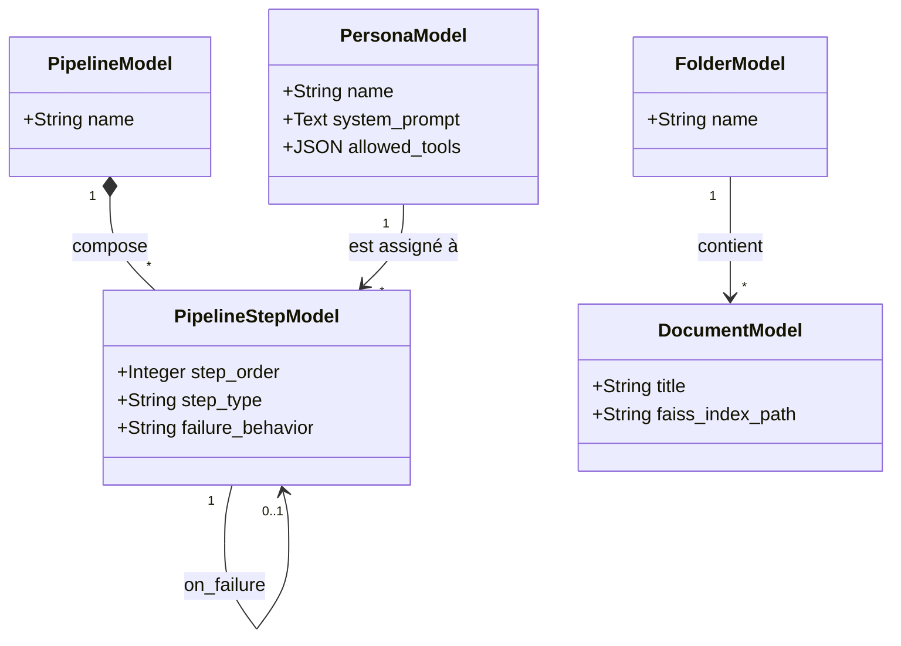

# Moteur d'Orchestration IA & Architecture Détaillée

Pour répondre aux contraintes du traitement massif (LLM locaux avec fenêtres de contexte limitées) et offrir une flexibilité totale, l'architecture IA d'AnkiForge abandonne le modèle de pipeline naïf (linéaire) au profit d'un **Moteur de Workflow Orienté Graphe (DAG) avec Map-Reduce et RAG natif**.

## 1. Refonte du Schéma de Données (Le Moteur de Pipeline)

Les anciens modèles Peewee sont détruits et repensés pour supporter des boucles et des permissions.

### A. PersonaModel (Ex-AgentModel)
Définit un rôle IA, mais augmenté avec des capacités (Tools).
* `name`, `system_prompt`, `output_format`
* `allowed_tools` (JSON) : Liste des fonctions Python que cette Persona a le droit d'appeler (ex: `["query_vector_db", "read_anki_stats"]`).
* `llm_config_id` : Clé étrangère pour forcer un modèle spécifique (ex: forcer un gros modèle cloud pour l'extraction, et un petit modèle local rapide pour le Linter).

### B. PipelineStepModel (Le cœur du réacteur)
Chaque étape du pipeline n'est plus seulement un appel LLM. Elle possède un `step_type` crucial :
1. **`LLM_PROMPT`** : Appel standard à une Persona.
2. **`RAG_RETRIEVAL`** : Recherche sémantique pure. Prend un mot-clé, interroge la base vectorielle, et injecte le résultat dans le *State*.
3. **`MAP_REDUCE`** : Le chaînon manquant. Prend une liste d'éléments (ex: 50 chunks d'un PDF, ou 100 cartes Anki) et exécute une sous-étape sur *chaque* élément en parallèle (Threads), puis fusionne les résultats.
4. **`HUMAN_VALIDATION`** : Met le pipeline en pause. Le *State* actuel est envoyé à l'UI. Le processus s'arrête tant que l'utilisateur n'a pas cliqué sur "Continuer" ou corrigé les données.

### C. State Management (Contexte)
Les pipelines n'envoient pas de simples strings d'une étape à l'autre. Ils se passent un objet **`PipelineRunState`** (un dictionnaire JSON en mémoire) qui s'enrichit.
* *Exemple :* L'étape 1 écrit dans `state["pdf_chunks"]`. L'étape 2 (MapReduce) lit `state["pdf_chunks"]` et écrit dans `state["draft_cards"]`.

---

## 2. Implémentation du RAG (Vectorisation)

SQLite standard n'est pas taillé pour le RAG.
* **Vector Store Local :** Utilisation de **FAISS** (Facebook AI Similarity Search) ou **ChromaDB** embarqué. Ils s'installent en local, n'ont pas de serveur lourd, et se couplent bien avec PySide6.
* **Ingestion (Pipeline de Document) :**
  1. L'utilisateur importe un PDF.
  2. *Marker* extrait le Markdown.
  3. Le texte est découpé par **Semantic Chunking** (et non au nombre de mots, pour ne pas couper au milieu d'un concept).
  4. Ces chunks sont envoyés à un modèle d'embedding (ex: `nomic-embed-text` via Ollama).
  5. Les vecteurs sont sauvés dans FAISS. Le `DocumentModel` de Peewee stocke juste les métadonnées (titre, chemin FAISS).

---

## 3. Architecture Détaillée par Module (Les Vues)

Voici comment ce moteur orchestre chaque partie de l'application :

### 📚 A. Module Documents (Ingestion & Base de Connaissances)
**Objectif :** C'est la porte d'entrée de la Forge (`documents_view.py`). Gérer l'importation, le nettoyage et la vectorisation des sources avant toute création de cartes.

**Interaction IHM (Délimitation de la source) :**
Pour éviter le gaspillage de ressources sur de gros documents, l'IHM effectue d'abord un scan léger (ex: `pypdf`). Une modale permet à l'utilisateur de définir une **plage de pages** (ex: "12-45") ou de **sélectionner des chapitres spécifiques**. AnkiForge tronque le document en mémoire pour ne conserver que la portion utile avant de lancer l'IA.

**Le Pipeline Workflow (Ingestion) :**
1. **Étape 1 (Parsing) :** La portion de document délimitée est transmise à l'outil d'extraction lourd (ex: *Marker* pour PDF, *yt-dlp* pour vidéo). Le texte brut est extrait.
2. **Étape 2 (`MAP_REDUCE` interne) :** Le texte est découpé en *Chunks sémantiques*.
3. **Étape 3 (Embeddings) :** Chaque chunk est passé dans le modèle d'embedding (Ollama local ou API externe).
4. **Sortie :** Enregistrement dans FAISS/ChromaDB. La vue met à jour le statut du document dans l'UI ("Prêt pour l'analyse") et affiche des métriques (nombre de pages, taille des vecteurs). Ce module sert de bibliothèque (Hub) où l'utilisateur classe ses sources dans des dossiers (`FolderModel`).

### 🏭 B. Module Création & Pipelines (Génération de Paquets)
**Objectif :** Transformer un PDF de 100 pages en un paquet Anki parfait sans crasher le modèle local.
**Le Pipeline Workflow :**
1. **Étape 1 (`RAG_RETRIEVAL`) :** Requête "Extrais les grands chapitres et concepts". Le RAG pioche les titres du PDF.
2. **Étape 2 (`LLM_PROMPT`) :** La Persona *Architecte* génère un Squelette JSON du cours.
3. **Étape 3 (`HUMAN_VALIDATION`) :** L'UI affiche l'arbre des chapitres. L'utilisateur décoche les chapitres hors-sujet.
4. **Étape 4 (`MAP_REDUCE`) :** Pour chaque chapitre validé, on lance une recherche RAG ciblée, puis on envoie le texte à la Persona *Rédacteur Anki* pour générer des cartes.
5. **Étape 5 (`LLM_PROMPT`) :** La Persona *Critique* (Linter) vérifie les cartes générées.
6. **Sortie :** Affichage dans la vue `creation_view.py` pour validation finale avant export.

### 🏥 C. Module Analyse & Audit (Linter et Doublons)
**Objectif :** Nettoyer un paquet de 5000 cartes existantes.
**Le Pipeline Workflow :**
1. **Étape 1 (`MAP_REDUCE`) :** On découpe les 5000 cartes en batchs de 50.
2. **Étape 2 (`LLM_PROMPT`) :** La Persona *Linter Wozniak* analyse chaque batch avec des règles strictes (ex: "Pas plus de 15 mots par verso").
3. **Étape 3 (Tri en mémoire) :** Les cartes flaguées "Malades" sont séparées.
4. **Sortie (`HUMAN_VALIDATION`) :** La vue `analysis_view.py` affiche une grille listant uniquement les cartes à corriger, avec la correction proposée par l'IA à côté. L'utilisateur clique sur "Accepter" ou "Ignorer".

### 🤖 D. Module Consultant (Agent Autonome)
**Objectif :** Un Chatbot "God-Mode" dans l'IDE, sans pipeline prédéfini.
**Architecture (Le Pattern ReAct - Reason & Act) :**
1. Le Consultant n'utilise *pas* de PipelineStepModel. Il tourne dans une boucle infinie de réflexion.
2. **Input Utilisateur :** *"Quels sont mes pires concepts en biologie ?"*
3. **Thought (LLM) :** "Je dois interroger la BDD Peewee pour trouver les cartes taguées biologie avec le plus bas taux de rétention."
4. **Action (Tool Call) :** Le Consultant appelle la fonction Python `execute_sql(query)`.
5. **Observation :** La fonction renvoie une liste JSON de cartes.
6. **Response (LLM) :** L'Agent formate la réponse dans le Chat et affiche les cartes cliquables dans l'UI (`consultant_view.py`).

### 🎨 E. Module Modèles de Cartes (Atelier)
**Objectif :** Générer de l'UI Anki sur demande.
**Architecture :**
Le Consultant dispose de l'outil `update_model_css(model_id, new_css)`. 
1. L'utilisateur demande "Fais des bordures violettes arrondies".
2. Le LLM génère le code.
3. Il déclenche le Tool Call.
4. PySide6 intercepte l'appel, met à jour la base Peewee, et recharge la *WebEngineView* (Aperçu de la carte) instantanément.
