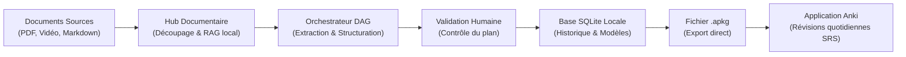
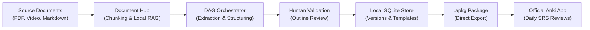

# AnkiForge


**AnkiForge** est un environnement de développement intégré (IDE) et compagnon de création de cartes mémoire pour l'écosystème Anki. Conçu pour les étudiants, enseignants et passionnés d'apprentissage, AnkiForge structure, audite et optimise la génération de flashcards à partir de documents de cours (PDF, vidéos, notes), tout en conservant vos données en local (Air-gapped).

> **Périmètre d'utilisation :** AnkiForge est un atelier de création et d'audit. Il ne remplace pas l'application officielle Anki pour les révisions quotidiennes (répétition espacée - SRS). La synchronisation s'effectue via l'import/export de paquets standard (`.apkg` et `.colpkg`).

---

## Flux de Données

AnkiForge organise la transformation d'un document brut en cartes prêtes pour la mémorisation à travers un flux supervisé :



1. **Ingestion :** Les documents sont nettoyés et découpés en fragments thématiques indexés localement.
2. **Génération & Validation :** L'IA extrait les concepts clés et soumet un plan modifiable à l'utilisateur avant la production finale des cartes.
3. **Audit & Export :** Les cartes générées sont vérifiées contre les règles de clarté de mémorisation puis exportées au format Anki.

---

## Guide de Démarrage Rapide

Créer votre premier paquet de cartes s'effectue en trois étapes simples :

1. **Importer votre source :** Dans l'onglet *Documents*, déposez votre support de cours (PDF, lien vidéo ou texte brut). Vous pouvez délimiter précisément les plages de pages ou les chapitres à traiter pour éviter le contenu superflu (sommaires, préfaces).
2. **Lancer un pipeline de création :** Dans l'onglet *Création*, sélectionnez un modèle de pipeline. Le système extrait un plan de cours et marque une pause interactive : vous pouvez décocher les notions secondaires ou ajouter des précisions avant la génération des cartes.
3. **Vérifier et exporter :** Une fois les cartes générées et ajustées, cliquez sur *Exporter (.apkg)* puis ouvrez le fichier directement dans Anki pour démarrer vos révisions quotidiennes.

---

## Positionnement et Comparatif

Chaque outil répond à un besoin spécifique dans l'apprentissage. Voici une comparaison objective pour situer le rôle d'AnkiForge :

| Critère | Application Anki officielle | Outils IA Web / En ligne | AnkiForge |
| :--- | :--- | :--- | :--- |
| **Objectif principal** | Réviser et mémoriser sur le long terme (algorithme SRS). | Créer rapidement des cartes depuis un navigateur sans installation. | Structurer, affiner et auditer des collections de cartes à partir de cours denses. |
| **Création de cartes** | Manuelle, carte par carte. | Automatique via un prompt simple en une seule passe. | Assistée par étapes avec validation intermédiaire du plan par l'utilisateur. |
| **Qualité des formulations** | Dépend uniquement de l'utilisateur. | Variable, risque de cartes trop longues ou verbeuses. | Contrôlée par un analyseur de qualité (règles pour des questions courtes, univoques et sans ambiguïté). |
| **Confidentialité des cours** | Données stockées localement sur votre appareil. | Données envoyées et traitées sur des serveurs distants tiers. | Traitement local-first (compatible modèles locaux Ollama) et base SQLite privée. |
| **Gestion des révisions (SRS)** | Optimale (application native de référence, applications mobiles). | Souvent absente ou basique. | Déléguée à Anki (AnkiForge ne gère pas les sessions de révision). |
| **Facilité de prise en main** | Simple et directe. | Immédiate (zéro installation requise). | Courbe d'apprentissage modérée (nécessite l'installation locale de l'application). |

---

## Fonctionnalités Principales

### 1. Moteur d'Orchestration et Supervision Humaine
* **Workflows par étapes :** Découpage de la tâche en étapes claires (`LLM_PROMPT`, `RAG_RETRIEVAL`, `MAP_REDUCE`, `HUMAN_VALIDATION`, `PYTHON_TOOL`).
* **Pause interactive :** L'IA ne génère pas de cartes à l'aveugle. Une fenêtre interactive permet d'ajuster le squelette du cours avant d'engager la création finale.
* **Scripts Python déterministes :** Intégration d'outils de nettoyage (formatage mathématique LaTeX, réparation JSON, calcul de métriques) exécutables de façon fiable.

### 2. Consultant IA et Protocole MCP
* **Assistance conversationnelle :** Un copilote capable de raisonner, de formuler des propositions et d'exécuter des actions sécurisées sur votre collection via une boucle ReAct (*Thought ➔ Action ➔ Observation ➔ Response*).
* **Outils connectés :** Requêtage de la base de données locale, calcul de statistiques sur les cartes difficiles, recherche sémantique et mise à jour de styles visuels à la demande.
* **Composants interactifs :** Affichage transparent des étapes de réflexion de l'IA et de résultats directement exploitables dans la discussion.

### 3. Contrôle Qualité et Analyse des Formulations
* **Vérification des règles de mémorisation :** Détection automatique des questions trop longues, des versos surchargés et des formulations ambiguës (fondé sur les 20 règles de formulation de Piotr Wozniak).
* **Règles personnalisées :** Possibilité de configurer ses propres critères d'audit classés par catégories visuelles.
* **Inspection comparative :** Visualisation côte-à-côte entre la carte d'origine et la reformulation suggérée, avec scission de carte en un clic.

### 4. Tests Comparatifs (Laboratoire A/B)
* **Comparaison multi-niveaux :** Testez et comparez simultanément deux modèles IA, deux prompts ou deux chaînes de traitement.
* **Indicateurs en direct :** Suivi du temps de traitement, du volume de cartes générées et de l'estimation de coût en jetons.
* **Importation directe :** Sélection de la version la plus convaincante pour intégration immédiate dans votre espace de travail.

### 5. Hub Documentaire et Recherche Sémantique Locale
* **Délimitation de document :** Découpage par plages de pages ou sections pour ne cibler que le contenu pertinent d'un cours.
* **Indexation locale (RAG) :** Stockage vectoriel local (FAISS/ChromaDB) pour retrouver les passages clés sans dépendre d'un service externe.
* **Couverture documentaire :** Suivi des sections de cours déjà converties en flashcards pour identifier les lacunes du paquet.

### 6. Gestion des Conflits et Résolution Visuelle
* **Protection du contenu :** Les changements de dossiers ou les métadonnées de révision sont fusionnés automatiquement ; seules les divergences de texte déclenchent un arbitrage.
* **Dialogue de fusion à 3 panneaux :** Vue différentielle (version locale vs version importée vs version fusionnée) pour accepter les modifications ligne par ligne.
* **Accélération native :** Comparaison textuelle optimisée en C avec solution de repli transparente en Python pur.

### 7. Atelier de Styles et Rendu Mathématique
* **Édition native et LaTeX :** Saisie mathématique en direct avec aperçu KaTeX et assistant de texte à trous (Cloze).
* **Historique des versions :** Sauvegarde chronologique des modifications apportées à chaque note (`NoteVersionModel`) pour revenir à un état antérieur.
* **Aperçu fidèle :** Rendu identique au moteur officiel Anki via composant WebEngine dédié.

### 8. Multi-Profils
* **Isolation complète :** Gestion de profils distincts, chacun disposant de sa propre base SQLite et de son dossier de médias.
* **Bascule rapide :** Changement de profil en un clic depuis l'interface principale.

---

## Stack Technique

* **Interface Graphique :** Python 3.12+ / PySide6 (Qt 6) / QtWebEngine
* **Base de Données & Migrations :** SQLite / Peewee ORM / `peewee-migrate` (17 migrations)
* **Gestionnaire de Projet :** `uv` (Astral)
* **Moteur Vectoriel & RAG :** FAISS CPU / ChromaDB / Embeddings locaux (Ollama) ou Cloud
* **Protocole & Moteurs IA :** Model Context Protocol (MCP) in-process / Ollama / Google Gemini / OpenAI / Anthropic
* **Accélération Bas Niveau :** Extension C native (`c_ext/levenshtein_distance.c`) avec fallback Python pur
* **Documentation & Site Statique :** Zensical
* **Qualité & CI/CD :** `pytest` (146 tests unitaires et UI), `pytest-qt`, `ruff`, `mypy`, `bandit`, compilation native Nuitka

---

## Installation et Démarrage

### Prérequis
* Python 3.12 ou supérieur
* [uv](https://docs.astral.sh/uv/) installé sur votre machine
* *(Optionnel)* Un compilateur C (`gcc` ou `clang`) pour compiler l'extension d'accélération de comparaison textuelle.

### 1. Cloner le dépôt
```bash
git clone https://github.com/votre-nom/AnkiForge.git
cd AnkiForge
```

### 2. Installer les dépendances avec `uv`
```bash
# Installation de l'application standard
uv sync

# Ou installation avec toutes les dépendances de développement et documentation
uv sync --group dev
```

### 3. (Optionnel) Compiler l'extension C
```bash
# Sur macOS / Linux
gcc -shared -o src/ankiforge/c_ext/levenshtein_distance.so -fPIC src/ankiforge/c_ext/levenshtein_distance.c

# Note: Si non compilé, AnkiForge utilise automatiquement le module de secours en pur Python.
```

### 4. Lancer l'application
```bash
uv run ankiforge
```

---

## Tests et Qualité

Le projet intègre une suite de tests automatisés couvrant le backend, la base de données, l'orchestrateur et l'interface graphique (mode headless via `pytest-qt`) :

```bash
# Exécuter les 146 tests unitaires et UI
uv run pytest

# Vérifier le formatage et le style du code
uv run ruff check .

# Vérifier le typage statique
uv run mypy src/ankiforge
```

---

## Documentation de Référence

La documentation technique complète d'AnkiForge est conçue pour être consultée via le générateur de documentation statique **Zensical**.

### 1. Installer l'environnement de développement
Assurez-vous d'avoir installé les dépendances de développement incluant Zensical :
```bash
uv sync --group dev
```

### 2. Lancer la documentation en local
Démarrez le serveur de documentation avec rechargement en direct (Live Reload) :
```bash
# Lancer le serveur local Zensical
uv run zensical serve
```
Le portail de documentation s'ouvre alors sur **`http://127.0.0.1:8000/`**.

Pour compiler les fichiers HTML statiques de la documentation :
```bash
uv run zensical build
```

### 3. Fichiers sources de référence
Vous pouvez également consulter directement les fichiers Markdown situés dans :
* [GEMINI.md](GEMINI.md) : Directives agentiques et règles d'architecture fondamentales.
* [`docs/Dossier_architecture/`](docs/Dossier_architecture/) :
  * [01_vision_et_cas_d_usage.md](docs/Dossier_architecture/01_vision_et_cas_d_usage.md) : Vision produit et ergonomie adaptative.
  * [02_architecture_technique.md](docs/Dossier_architecture/02_architecture_technique.md) : Stack technique et gestion des dépendances.
  * [03_modele_donnees_synchro.md](docs/Dossier_architecture/03_modele_donnees_synchro.md) : Modèle de données Peewee et politique de fusion.
  * [04_ui_ux_et_maquettes.md](docs/Dossier_architecture/04_ui_ux_et_maquettes.md) : Cartographie des vues et navigation.
  * [05_services_ia_et_analyse.md](docs/Dossier_architecture/05_services_ia_et_analyse.md) : Services IA, ReAct, protocole MCP et audit.
  * [06_moteur_orchestration_ia.md](docs/Dossier_architecture/06_moteur_orchestration_ia.md) : Moteur DAG, Map-Reduce et état partagé.
  * [07_inventaire_composants_ui.md](docs/Dossier_architecture/07_inventaire_composants_ui.md) : Inventaire exhaustif des widgets et dialogues.
  * [08_plan_implementation_global.md](docs/Dossier_architecture/08_plan_implementation_global.md) : Rapport d'architecture des modules implémentés.
  * [09_qualite_et_deploiement.md](docs/Dossier_architecture/09_qualite_et_deploiement.md) : Standards de test, CI/CD et compilation Nuitka.

---

## Licence

Distribué sous licence MIT. Consultez le fichier [LICENSE.md](LICENSE.md) pour plus d'informations.

<br/>

---
---

<br/>

# AnkiForge (English Version)


**AnkiForge** is an Integrated Development Environment (IDE) and flashcard forging companion for the Anki ecosystem. Tailored for students, researchers, and lifelong learners, AnkiForge structures, audits, and streamlines AI-assisted flashcard generation from course materials (PDFs, videos, Markdown notes) while keeping your data **100% local and air-gapped**.

> **Scope Notice:** AnkiForge is a dedicated creation and audit workshop. It does not replace the official Anki application for daily spaced repetition reviews (SRS). Synchronization is performed through standard `.apkg` and `.colpkg` package imports/exports.

---

## Dataflow Overview

AnkiForge transforms raw materials into structured flashcards through a supervised pipeline:



1. **Ingestion:** Source materials are parsed, chunked, and vector-indexed locally.
2. **Generation & Validation:** The AI engine extracts key concepts and presents a reviewable outline before generating cards.
3. **Audit & Export:** Cards are validated against cognitive formulation rules and exported directly into Anki packages.

---

## Quickstart Guide

Create your first flashcard deck in three simple steps:

1. **Import your source material:** In the *Documents* tab, drop your course document (PDF, video URL, or raw text). Use page delimitation to filter out unwanted sections (table of contents, references).
2. **Run a generation pipeline:** In the *Creation* tab, select a pipeline preset. The orchestrator extracts a structured outline and pauses: review and adjust concepts before card generation begins.
3. **Review and export:** Once cards are generated, click *Export (.apkg)* and open the resulting package in Anki to start your daily study sessions.

---

## Positioning and Comparison

Every tool serves a specific purpose in learning workflows. Here is an objective comparison:

| Criteria | Official Anki Application | Online / Cloud AI Tools | AnkiForge |
| :--- | :--- | :--- | :--- |
| **Primary Focus** | Daily spaced repetition review (SRS algorithm). | Quick browser-based card generation without local installation. | Structuring, refining, and auditing large flashcard collections from dense material. |
| **Card Creation** | Manual, card by card. | Automatic one-shot prompts. | Multi-step assisted workflow with human outline validation. |
| **Formulation Quality** | Fully dependent on the author. | Inconsistent; prone to verbose or ambiguous cards. | Monitored by a formulation quality analyzer (enforcing atomic, unambiguous cards). |
| **Data Privacy** | Stored locally on user devices. | Transferred to and processed on remote cloud servers. | Local-first architecture (compatible with local Ollama models) and private SQLite store. |
| **Study Sessions (SRS)** | Industry standard (desktop and mobile apps). | Frequently missing or basic. | Delegated to official Anki (AnkiForge does not host review sessions). |
| **Learning Curve** | Simple and direct. | Instant (no installation needed). | Moderate (requires local desktop application setup). |

---

## Key Features

### 1. DAG Workflow Orchestration & Human Supervision
* **Step-based pipelines:** Modular step types including `LLM_PROMPT`, `RAG_RETRIEVAL`, `MAP_REDUCE`, `HUMAN_VALIDATION`, and `PYTHON_TOOL`.
* **Interactive copiloting:** The orchestrator pauses at validation steps, enabling users to inspect, adjust, or prune concepts before mass generation.
* **Deterministic Python tools:** Built-in sandboxed tools for LaTeX cleaning, JSON validation, and metric computations.

### 2. Autonomous ReAct AI Consultant & MCP
* **ReAct loop:** Continuous reasoning (*Thought ➔ Action ➔ Observation ➔ Response*) with automated tool-call recovery.
* **In-process MCP server:** Secure tools for querying local SQLite tables, computing leech card statistics, searching decks, and hot-reloading CSS styles.
* **Interactive UI components:** Collapsible reasoning logs, visual tool cards, and direct one-click action widgets within chat.

### 3. Formulation Quality Analyzer (Linter)
* **Cognitive rule checking:** Automatic detection of oversized cards, cluttered back templates, and ambiguous questions (based on Piotr Wozniak's formulation principles).
* **Custom rules engine:** Configurable database rules organized by visual categories (`cat-atomicite`, `cat-interferences`, etc.).
* **Side-by-side inspection:** 5-field comparative inspector between original notes and AI suggestions with 1-click card splitting.

### 4. A/B Testing Laboratory
* **Tri-mode comparisons:** Compare Model vs Model, Prompt vs Prompt, or Pipeline vs Pipeline concurrently in `QThreadPool`.
* **Live metrics:** Real-time benchmark banner displaying runtime duration, card yield, token count, and cost estimation.
* **Direct import:** One-click integration of winning configurations directly into your Forge workspace.

### 5. Document Hub & Local Semantic RAG
* **Smart delimitation:** Select specific page ranges and headings to exclude boilerplate text.
* **Local vector search:** FAISS and ChromaDB indexing for retrieving course context without cloud dependencies.
* **Coverage tracking:** Live document section statuses (`Covered` vs `Uncovered`) and instant section forging.

### 6. Smart Conflict Resolution (3-Panel Merge)
* **Content-first safety:** Deck movements and review statistics are merged silently; only raw text field edits trigger manual review.
* **3-panel merge dialog:** Side-by-side view (Local vs Incoming vs Merged) with selective line-by-line acceptance.
* **Native C acceleration:** Compiled Levenshtein C extension with transparent Python fallback.

### 7. Note Styling & KaTeX Rendering
* **Native Qt editor:** Live LaTeX KaTeX rendering, autocomplete, and Cloze deletion tooling.
* **Time Machine history:** Complete note version audit trail (`NoteVersionModel`).
* **WebEngine preview:** Pixel-perfect rendering matching official Anki behavior.

### 8. Multi-Profile Isolation
* **Full data segregation:** Separate SQLite databases and media folders under `~/.ankiforge/profiles/<profile_name>/`.
* **Instant switching:** Profile switcher available directly in the main window.

---

## Technical Stack

* **GUI Framework:** Python 3.12+ / PySide6 (Qt 6) / QtWebEngine
* **Database & ORM:** SQLite / Peewee ORM / `peewee-migrate` (17 migrations)
* **Package Manager:** `uv` (Astral)
* **Vector Store & RAG:** FAISS CPU / ChromaDB / Local (Ollama) or Cloud embeddings
* **AI Protocol & Providers:** In-process Model Context Protocol (MCP) / Ollama / Google Gemini / OpenAI / Anthropic
* **Native Optimization:** Compiled C extension (`c_ext/levenshtein_distance.c`) with Python fallback
* **Documentation Generator:** Zensical
* **Quality Assurance:** `pytest` (146 unit & UI tests), `pytest-qt`, `ruff`, `mypy`, `bandit`, Nuitka compiler

---

## Getting Started

### Prerequisites
* Python 3.12 or newer
* [uv](https://docs.astral.sh/uv/) package manager
* *(Optional)* C compiler (`gcc` or `clang`) for compiling the Levenshtein performance extension.

### 1. Clone the repository
```bash
git clone https://github.com/votre-nom/AnkiForge.git
cd AnkiForge
```

### 2. Install dependencies with `uv`
```bash
# Standard application install
uv sync

# Or install including developer and documentation tools
uv sync --group dev
```

### 3. (Optional) Compile the C extension
```bash
# macOS / Linux
gcc -shared -o src/ankiforge/c_ext/levenshtein_distance.so -fPIC src/ankiforge/c_ext/levenshtein_distance.c

# Note: If omitted, AnkiForge automatically falls back to pure Python execution.
```

### 4. Run AnkiForge
```bash
uv run ankiforge
```

---

## Testing & Quality

Run the test suite covering backend logic, database operations, DAG workflows, and headless GUI components (`pytest-qt`):

```bash
# Run all 146 unit and UI tests
uv run pytest

# Check code style and linting
uv run ruff check .

# Check static typing
uv run mypy src/ankiforge
```

---

## Reference Documentation

AnkiForge's complete technical documentation is built to be served locally with **Zensical**.

### 1. Setup development dependencies
Ensure the development dependencies (including Zensical) are installed:
```bash
uv sync --group dev
```

### 2. Launch documentation locally
Start the local live-reloading documentation server:
```bash
# Start Zensical live server
uv run zensical serve
```
Navigate to **`http://127.0.0.1:8000/`** in your browser.

To build static HTML assets:
```bash
uv run zensical build
```

### 3. Source reference documents
You can also browse the source Markdown files in:
* [GEMINI.md](GEMINI.md) : Agentic system prompt and core engineering rules.
* [`docs/Dossier_architecture/`](docs/Dossier_architecture/) :
  * [01_vision_et_cas_d_usage.md](docs/Dossier_architecture/01_vision_et_cas_d_usage.md) : Product vision and adaptive UX.
  * [02_architecture_technique.md](docs/Dossier_architecture/02_architecture_technique.md) : Technical stack and dependency strategy.
  * [03_modele_donnees_synchro.md](docs/Dossier_architecture/03_modele_donnees_synchro.md) : Peewee models and merge policy.
  * [04_ui_ux_et_maquettes.md](docs/Dossier_architecture/04_ui_ux_et_maquettes.md) : View mapping and layout principles.
  * [05_services_ia_et_analyse.md](docs/Dossier_architecture/05_services_ia_et_analyse.md) : AI services, ReAct loop, MCP, and quality audit.
  * [06_moteur_orchestration_ia.md](docs/Dossier_architecture/06_moteur_orchestration_ia.md) : DAG engine, Map-Reduce, and state management.
  * [07_inventaire_composants_ui.md](docs/Dossier_architecture/07_inventaire_composants_ui.md) : Exhaustive inventory of widgets and dialogs.
  * [08_plan_implementation_global.md](docs/Dossier_architecture/08_plan_implementation_global.md) : Architecture report and implemented modules.
  * [09_qualite_et_deploiement.md](docs/Dossier_architecture/09_qualite_et_deploiement.md) : Testing standards, CI/CD, and Nuitka builds.

---

## License

Distributed under the MIT License. See [LICENSE.md](LICENSE.md) for details.
