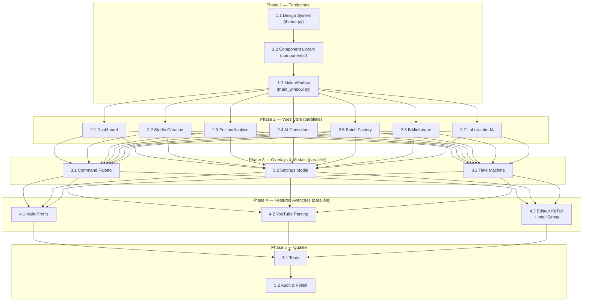

# 🏗️ Plan d'Implémentation AnkiForge — Rewrite Complet

> **Référence** : Maquette `concept_ide` (JetBrains IDE-style)
> **Scope** : Rewrite complet de la couche UI + ajout des features manquantes
> **Conservation** : DB schema (18 modèles Peewee), services core (AI, parsing, cards)
> **Standard** : Python 3.12+, PySide6, Peewee, `uv`

---

## 📐 Architecture Cible (Résumé)



---

## 📁 Arborescence Cible

```
src/ankiforge/
├── __init__.py
├── __main__.py                          # MODIFIER — multi-profil + nouveau bootstrap
├── c_ext/                               # CONSERVER tel quel
├── database/
│   ├── __init__.py
│   ├── backup.py                        # CONSERVER
│   ├── migration.py                     # CONSERVER
│   ├── migrations/                      # CONSERVER + nouvelles migrations
│   └── models.py                        # CONSERVER (étendre si profils)
├── ressources/                          # CONSERVER
├── services/
│   ├── __init__.py
│   ├── ai/
│   │   ├── __init__.py
│   │   ├── base.py                      # CONSERVER
│   │   ├── flexible_service.py          # MODIFIER — ajouter AnthropicProvider
│   │   ├── gemini_service.py            # CONSERVER
│   │   ├── pricing_service.py           # CONSERVER
│   │   └── utils.py                     # CONSERVER
│   ├── cards/
│   │   ├── __init__.py
│   │   ├── duplicate_manager.py         # CONSERVER
│   │   ├── export_manager.py            # CONSERVER
│   │   ├── media_manager.py             # CONSERVER
│   │   ├── note_manager.py              # CONSERVER
│   │   └── store_manager.py             # CONSERVER (fix bug L221)
│   ├── parsing/
│   │   ├── __init__.py
│   │   ├── document_parser.py           # CONSERVER + refactor
│   │   └── youtube_parser.py            # 🆕 CRÉER
│   ├── profile_manager.py               # 🆕 CRÉER
│   ├── background_daemon.py             # RENOMMER (fix typo) + étendre
│   └── workers/
│       ├── ab_worker.py                 # CONSERVER
│       ├── batch_edit_worker.py         # CONSERVER
│       ├── batch_worker.py              # CONSERVER
│       ├── consultant_worker.py         # CONSERVER
│       ├── creation_worker.py           # CONSERVER
│       ├── document_worker.py           # CONSERVER
│       ├── import_cards_worker.py       # CONSERVER
│       ├── linter_worker.py             # CONSERVER
│       └── youtube_worker.py            # 🆕 CRÉER
├── ui/
│   ├── __init__.py
│   ├── theme.py                         # 🔄 RÉÉCRIRE — nouveau design system
│   ├── main_window.py                   # 🔄 RÉÉCRIRE — sidebar + topbar
│   ├── components/
│   │   ├── __init__.py
│   │   ├── buttons.py                   # 🆕 PrimaryBtn, SecondaryBtn, DangerBtn, IconBtn, GlowBtn
│   │   ├── inputs.py                    # 🆕 InputElement, TextAreaElement, GlowInput, ToggleSwitch
│   │   ├── panels.py                    # 🆕 IdePanel, GlassPanel, MetricCard, StatCard
│   │   ├── tabs.py                      # 🆕 IdeTabs (draggable), PillTabs, SettingsTabs
│   │   ├── lists.py                     # 🆕 ListItem, ActivityItem, DocItem, ContextItem
│   │   ├── badges.py                    # 🆕 Badge, BadgeOutline, BadgeStatus, TagBtn
│   │   ├── tables.py                    # 🆕 StyledTable, CicdTable
│   │   ├── misc.py                      # 🆕 Avatar, Toolbar, DaemonStatus, ProgressBar
│   │   └── code_editor.py              # 🆕 CodeEditorWidget (line numbers, syntax)
│   ├── widgets/
│   │   ├── __init__.py
│   │   ├── command_palette.py           # 🆕 CRÉER
│   │   ├── time_machine_dialog.py       # 🆕 CRÉER (timeline + diff)
│   │   ├── settings_modal.py            # 🆕 CRÉER (4 tabs)
│   │   ├── katex_editor.py              # 🆕 CRÉER (natif Qt + rendu KaTeX)
│   │   ├── card_preview_widget.py       # CONSERVER + adapter au nouveau design
│   │   ├── mobile_preview_frame.py      # 🆕 CRÉER (iPhone-style frame)
│   │   ├── filter_sidebar.py            # CONSERVER + adapter
│   │   ├── note_table_widget.py         # CONSERVER + adapter
│   │   ├── note_editor_widget.py        # 🔄 RÉÉCRIRE → utiliser KaTeX editor
│   │   ├── duplicate_resolver.py        # CONSERVER + adapter
│   │   ├── auto_tag_dialog.py           # CONSERVER + adapter
│   │   ├── toast.py                     # CONSERVER + adapter
│   │   └── omnibox.py                   # SUPPRIMER (remplacé par command_palette)
│   └── views/
│       ├── __init__.py
│       ├── dashboard_view.py            # 🆕 CRÉER
│       ├── creation_view.py             # 🔄 RÉÉCRIRE
│       ├── edition_view.py              # 🔄 RÉÉCRIRE
│       ├── consultant_view.py           # 🔄 RÉÉCRIRE
│       ├── batch_cicd_view.py           # 🆕 CRÉER (remplace batch_view.py)
│       ├── batch_kanban_view.py         # 🆕 CRÉER
│       ├── batch_wizard_view.py         # 🆕 CRÉER
│       ├── documents_view.py            # 🔄 RÉÉCRIRE
│       ├── models_view.py               # 🔄 RÉÉCRIRE
│       ├── agents_view.py               # 🔄 RÉÉCRIRE
│       ├── pipelines_view.py            # 🆕 CRÉER (séparé de agents)
│       └── ab_test_view.py              # 🔄 RÉÉCRIRE
```

---

## 🏛️ PHASE 1 — FONDATIONS (Séquentiel)

> **Durée estimée** : 1 agent, 3 tâches séquentielles
> **Pré-requis** : Aucun
> **Bloquant pour** : Toutes les phases suivantes

### 📋 Tâche 1.1 — Design System & Theme

**Agent** : `foundation-theme-agent`
**Skill à lire** : `~/.gemini/skills/technologies/application/python/qt/pyside6-modern-ui.md`
**Fichier** : `src/ankiforge/ui/theme.py` (réécriture complète)

#### Objectif
Réécrire `theme.py` pour implémenter le design system de la maquette `concept_ide` en Qt natif. Le fichier doit être le **point unique de vérité** pour toutes les valeurs visuelles.

#### Spécification Technique

```python
# === src/ankiforge/ui/theme.py ===

# 1. CONSTANTES DU DESIGN SYSTEM (extraites de concept_ide/styles.css)
class DesignTokens:
    """Point unique de vérité — toutes les valeurs visuelles."""

    # Backgrounds (dark)
    BG_MAIN = "#0f1115"
    BG_SIDEBAR = "#16181d"
    BG_PANEL = "#1e2128"
    BG_INPUT = "#1a1d24"
    BG_HOVER = "#2d313a"
    BG_ACTIVE = "rgba(99, 102, 241, 0.1)"

    # Accent
    ACCENT_PRIMARY = "#6366f1"  # Indigo-500
    ACCENT_HOVER = "#4f46e5"    # Indigo-600

    # Text
    TEXT_PRIMARY = "#f8fafc"
    TEXT_SECONDARY = "#94a3b8"
    TEXT_MUTED = "#64748b"

    # Borders
    BORDER_COLOR = "#2d313a"
    BORDER_LIGHT = "rgba(255, 255, 255, 0.04)"

    # Semantic
    COLOR_BLUE = "#3b82f6"
    COLOR_GREEN = "#10b981"
    COLOR_YELLOW = "#f59e0b"
    COLOR_RED = "#ef4444"
    COLOR_PURPLE = "#8b5cf6"

    # Radius
    RADIUS_SM = 6    # buttons, inputs
    RADIUS_MD = 10   # panels, cards
    RADIUS_LG = 16   # modals, hero sections

    # Shadows (pour QGraphicsDropShadowEffect — natif Qt, pas CSS)
    SHADOW_SM_BLUR = 2
    SHADOW_MD_BLUR = 12
    SHADOW_GLASS_BLUR = 32

    # Typography
    FONT_MAIN = "Inter"
    FONT_CODE = "Fira Code"
    FONT_SIZE_BASE = 13
    FONT_SIZE_SMALL = 11
    FONT_SIZE_CODE = 12

    # Sidebar
    SIDEBAR_WIDTH_EXPANDED = 260
    SIDEBAR_WIDTH_COLLAPSED = 68
    TOPBAR_HEIGHT = 60
    GLOBAL_TOPBAR_HEIGHT = 28


# 2. FONCTIONS QPalette (garder le pattern existant mais avec nouveaux tokens)
def create_dark_palette() -> QPalette: ...
def create_light_palette() -> QPalette: ...

# 3. GLOBAL STYLESHEET (QSS uniquement pour esthétique, PAS layout)
def get_global_stylesheet(is_dark: bool) -> str: ...

# 4. FONCTIONS UTILITAIRES (conserver celles existantes)
def setup_dynamic_theme(app: QApplication) -> None: ...
def refresh_theme_live() -> None: ...
def is_dark_mode() -> bool: ...
def get_icon_color() -> str: ...

# 5. HELPER : appliquer shadow native Qt
def apply_shadow(widget: QWidget, blur: int = 12, offset_y: int = 4, color: str = "rgba(0,0,0,0.5)") -> None:
    """Applique QGraphicsDropShadowEffect — JAMAIS de CSS box-shadow."""
    ...
```

#### Règles Impératives
- ❌ **JAMAIS** de CSS pour le layout (margins, paddings) — utiliser Qt Layouts
- ❌ **JAMAIS** de `box-shadow` CSS — utiliser `QGraphicsDropShadowEffect`
- ✅ QSS uniquement pour couleurs, fonts, border-radius, backgrounds
- ✅ `QPalette` pour le theming système (dark/light auto-switch)
- ✅ Police **Inter** chargée via `QFontDatabase.addApplicationFont()`

#### Critères d'Acceptation
- [ ] `DesignTokens` contient TOUTES les valeurs du design system
- [ ] `create_dark_palette()` produit une palette correspondant au thème mockup
- [ ] `get_global_stylesheet(True)` génère un QSS complet (scrollbars, inputs, tables, combobox)
- [ ] `apply_shadow()` utilise `QGraphicsDropShadowEffect` (natif)
- [ ] Police Inter chargée au démarrage
- [ ] Tests : instanciation d'un `QApplication` avec le theme ne crashe pas

---

### 📋 Tâche 1.2 — Component Library

**Agent** : `foundation-components-agent`
**Skill à lire** : `~/.gemini/skills/technologies/application/python/qt/pyside6-modern-ui.md`
**Dépend de** : Tâche 1.1 (theme.py doit exister)
**Fichiers à créer** : Tout le package `src/ankiforge/ui/components/`

#### Objectif
Créer une bibliothèque de composants Qt réutilisables correspondant exactement aux composants identifiés dans la maquette. Chaque composant utilise `DesignTokens` de `theme.py`.

#### Composants à implémenter

**`components/buttons.py`** :
```python
class PrimaryButton(QPushButton):
    """Bouton principal indigo avec glow. Usage: actions primaires."""
    # BG: ACCENT_PRIMARY, hover: ACCENT_HOVER
    # Shadow glow: 0 0 10px rgba(99,102,241,0.4) via QGraphicsDropShadowEffect
    # Hover: shadow intensifie + translateY(-1px) via animation

class SecondaryButton(QPushButton):
    """Bouton secondaire avec bordure. Usage: actions secondaires."""
    # BG: BG_PANEL, border: BORDER_COLOR

class DangerButton(QPushButton):
    """Bouton danger rouge. Variantes: filled et ghost."""
    def __init__(self, text: str, ghost: bool = False, parent: QWidget | None = None): ...

class IconButton(QPushButton):
    """Bouton icône 32x32 transparent. Usage: toolbars."""
    def __init__(self, icon_name: str, tooltip: str = "", size: int = 32, parent: QWidget | None = None): ...

class PremiumActionCard(QFrame):
    """Grande carte d'action avec icône + titre + description. Usage: Dashboard."""
    def __init__(self, icon_name: str, title: str, description: str, parent: QWidget | None = None): ...
    clicked = Signal()
```

**`components/panels.py`** :
```python
class IdePanel(QFrame):
    """Panneau IDE avec tab bar, titre, bouton détacher."""
    def __init__(self, title: str, detachable: bool = False, parent: QWidget | None = None): ...
    detach_requested = Signal()
    def add_tab(self, title: str, widget: QWidget, icon_name: str = "") -> None: ...
    def set_active_tab(self, index: int) -> None: ...

class GlassPanel(QFrame):
    """Panneau glassmorphism (semi-transparent + blur effect)."""
    # Note: backdrop-filter n'existe pas en Qt.
    # STRATÉGIE: utiliser QGraphicsBlurEffect sur un QLabel de fond
    # ou simplement un fond semi-transparent rgba(30, 33, 40, 0.6)
    # avec QGraphicsDropShadowEffect(blur=32)

class MetricCard(QFrame):
    """Carte métrique avec valeur, label, icône, trend. Usage: Batch CI/CD, Stats."""
    def __init__(self, label: str, value: str, icon_name: str,
                 trend: str = "", trend_positive: bool = True,
                 parent: QWidget | None = None): ...
    def set_value(self, value: str) -> None: ...

class StatCard(QFrame):
    """Carte statistique. Usage: Dashboard sidebar, Settings stats."""
    def __init__(self, label: str, value: str, parent: QWidget | None = None): ...
```

**`components/tabs.py`** :
```python
class IdeTabBar(QWidget):
    """Tab bar style JetBrains avec indicateur accent 2px en haut."""
    tab_changed = Signal(int)
    tab_reordered = Signal(int, int)  # from_index, to_index
    tab_close_requested = Signal(int)
    def add_tab(self, title: str, icon_name: str = "", closable: bool = False) -> int: ...
    def set_active(self, index: int) -> None: ...
    # Drag & drop entre tabs pour réordonner

class PillTabBar(QWidget):
    """Tab bar style pill/segment. Usage: sous-navigation dans les panneaux."""
    tab_changed = Signal(int)
    def add_tab(self, title: str) -> int: ...

class SettingsTabBar(QWidget):
    """Tab bar verticale pour le modal Settings."""
    tab_changed = Signal(int)
    def add_tab(self, title: str, icon_name: str) -> int: ...
```

**`components/inputs.py`** :
```python
class StyledLineEdit(QLineEdit):
    """Input avec style design system. Focus = glow indigo."""

class StyledTextEdit(QPlainTextEdit):
    """Textarea avec style design system."""

class GlowLineEdit(QLineEdit):
    """Input avec glow accentué au focus. Usage: recherche, omnibox."""

class ToggleSwitch(QWidget):
    """Toggle iOS-style (36x20px). Usage: Settings."""
    toggled = Signal(bool)
    def is_checked(self) -> bool: ...
    def set_checked(self, checked: bool) -> None: ...

class StyledComboBox(QComboBox):
    """ComboBox avec style design system."""
```

**`components/lists.py`** :
```python
class StyledListItem(QWidget):
    """Item de liste générique avec hover/active."""
    clicked = Signal()

class ActivityItem(QWidget):
    """Item d'activité : icône + texte principal + texte secondaire + timestamp."""
    def __init__(self, icon_name: str, title: str, subtitle: str,
                 timestamp: str, parent: QWidget | None = None): ...

class DocTreeItem(QWidget):
    """Item d'arbre de fichiers avec icône, caret expand, nom."""

class ContextItem(QWidget):
    """Item de contexte AI avec badge type + nom + bouton supprimer."""
    removed = Signal()
```

**`components/badges.py`** :
```python
class Badge(QLabel):
    """Pill badge. Variantes: filled, outline, status, glass."""
    def __init__(self, text: str, variant: str = "filled",
                 color: str = "", parent: QWidget | None = None): ...

class TagButton(QPushButton):
    """Tag pill avec code font + tint accent. Usage: tags de notes."""
    def __init__(self, text: str, removable: bool = False, parent: QWidget | None = None): ...
    removed = Signal(str)
```

**`components/tables.py`** :
```python
class StyledTableWidget(QTableWidget):
    """Table avec style design system: sticky headers, hover rows, active row."""
    def __init__(self, columns: list[str], parent: QWidget | None = None): ...
    def set_active_row(self, row: int) -> None: ...

class CicdTable(StyledTableWidget):
    """Variante CI/CD : headers uppercase, wider padding."""
```

**`components/misc.py`** :
```python
class UserAvatar(QWidget):
    """Avatar 32px avec gradient. Affiche les initiales."""
    def __init__(self, initials: str, size: int = 32, parent: QWidget | None = None): ...

class StyledToolbar(QWidget):
    """Toolbar flex avec gap-8. Variantes: left, right, space-between."""
    def add_widget(self, widget: QWidget) -> None: ...
    def add_stretch(self) -> None: ...
    def add_separator(self) -> None: ...

class DaemonStatusWidget(QWidget):
    """Pill statut daemon : spinning icon + texte. Usage: topbar."""
    def set_status(self, status: str, text: str) -> None: ...
    # status: "active" (orange spin), "pending" (blue clock), "idle" (gray)

class ProgressBarWidget(QWidget):
    """Barre de progression 6px avec glow fill."""
    def set_progress(self, value: int) -> None: ...  # 0-100

class DropZone(QFrame):
    """Zone de drag & drop avec bordure dashed. Usage: Dashboard, Wizard."""
    files_dropped = Signal(list)  # list[str] — chemins de fichiers
    def __init__(self, text: str = "Glissez vos fichiers ici",
                 accept_extensions: list[str] | None = None,
                 parent: QWidget | None = None): ...
```

**`components/code_editor.py`** :
```python
class CodeEditorWidget(QWidget):
    """Éditeur de code avec numéros de ligne et coloration syntaxique basique."""
    text_changed = Signal()
    def __init__(self, language: str = "css", parent: QWidget | None = None): ...
    # language: "css", "html", "jinja2"
    # Fond: #0d0f12, gutter: #121419, police: Fira Code 12px
    def get_text(self) -> str: ...
    def set_text(self, text: str) -> None: ...
    # Utilise QPlainTextEdit + QSyntaxHighlighter custom
```

#### Critères d'Acceptation
- [ ] Chaque composant est dans son propre fichier thématique
- [ ] Tous les composants utilisent `DesignTokens` (pas de valeurs hardcodées)
- [ ] Aucun composant ne fait de layout via CSS — uniquement Qt Layouts
- [ ] Shadows via `QGraphicsDropShadowEffect`
- [ ] Tous les composants ont des type hints Python 3.12+
- [ ] `__init__.py` exporte tous les composants pour import facile
- [ ] Aucun `print()` dans le code — utiliser `logging`

---

### 📋 Tâche 1.3 — Main Window & Navigation

**Agent** : `foundation-navigation-agent`
**Skill à lire** : `~/.gemini/skills/technologies/application/python/qt/pyside6-modern-ui.md`
**Dépend de** : Tâches 1.1 + 1.2
**Fichier** : `src/ankiforge/ui/main_window.py` (réécriture complète)

#### Objectif
Réécrire la fenêtre principale avec la navigation sidebar de la maquette (remplace le système Activity Bar + Drawer actuel).

#### Architecture Navigation

```
┌──────────────────────────────────────────────────────────────┐
│ .global-topbar (28px, titre centré "AnkiForge", macOS drag)  │
├──────────────────────────────────────────────────────────────┤
│ ┌─────────────┬──────────────────────────────────────────────┐│
│ │  Sidebar    │  Main Content                                ││
│ │  (260px)    │  ┌──────────────────────────────────────────┐││
│ │             │  │ Topbar (60px)                            │││
│ │  ┌────────┐ │  │  Omnibox(400px) | Daemon | Tokens | 🔔  │││
│ │  │ Logo   │ │  ├──────────────────────────────────────────┤││
│ │  │ Toggle │ │  │                                          │││
│ │  ├────────┤ │  │  QStackedWidget (toutes les vues)        │││
│ │  │Général │ │  │                                          │││
│ │  │ └ Dashboard │                                          │││
│ │  ├────────┤ │  │                                          │││
│ │  │Forge   │ │  │                                          │││
│ │  │ ├ Création  │                                          │││
│ │  │ ├ Édition   │                                          │││
│ │  │ ├ Consultant│                                          │││
│ │  │ └ Batch     │                                          │││
│ │  ├────────┤ │  │                                          │││
│ │  │Biblio  │ │  │                                          │││
│ │  │ ├ Documents │                                          │││
│ │  │ └ Models    │                                          │││
│ │  ├────────┤ │  │                                          │││
│ │  │Lab IA  │ │  │                                          │││
│ │  │ ├ Agents    │                                          │││
│ │  │ ├ Pipelines │                                          │││
│ │  │ └ Tests AB  │                                          │││
│ │  ├────────┤ │  │                                          │││
│ │  │[Footer]│ │  │                                          │││
│ │  │⚙ Param │ │  │                                          │││
│ │  │👤 User │ │  │                                          │││
│ │  └────────┘ │  └──────────────────────────────────────────┘││
│ └─────────────┴──────────────────────────────────────────────┘│
└──────────────────────────────────────────────────────────────┘
```

#### Spécification Technique

```python
# === src/ankiforge/ui/main_window.py ===

class Sidebar(QWidget):
    """Sidebar collapsible 260px ↔ 68px."""
    view_selected = Signal(str)  # émet le view_id
    settings_requested = Signal()
    toggle_requested = Signal()

    def __init__(self, parent: QWidget | None = None) -> None: ...
    def set_collapsed(self, collapsed: bool) -> None: ...
    def set_active_view(self, view_id: str) -> None: ...

    # Structure interne:
    # - Logo header (icône ph-cube-transparent + "ankiforge_obsidian" + toggle btn)
    # - QScrollArea contenant les sections :
    #   Section "Général" → [Dashboard]
    #   Section "Forge & Outils" → [Création, Édition, Consultant, Batch Factory]
    #   Section "Bibliothèque" → [Documents, Card Models]
    #   Section "Laboratoire IA" → [Agents, Pipelines, Tests A/B]
    # - Footer fixe : Paramètres + User info

class TopBar(QWidget):
    """Barre supérieure 60px : omnibox + actions daemon/tokens/notifications."""
    search_clicked = Signal()  # ouvre le Command Palette
    def __init__(self, parent: QWidget | None = None) -> None: ...
    def update_daemon_status(self, status: str, text: str) -> None: ...
    def update_token_tracker(self, cost: str, tokens: str) -> None: ...

class MainWindow(QMainWindow):
    """Fenêtre principale ankiforge_obsidian."""

    def __init__(self, ai_manager: AIManager) -> None:
        # 1. Global topbar (28px) — titre centré, draggable
        # 2. App body (QHBoxLayout)
        #    - Sidebar (260px, collapsible)
        #    - Main content (QVBoxLayout, stretch=1)
        #      - TopBar (60px)
        #      - QStackedWidget (stretch=1)
        # 3. Register all views via _register_view()
        # 4. Start BackgroundDaemon
        ...

    def _register_view(self, view_id: str, widget: QWidget) -> None:
        """Ajoute un widget au QStackedWidget avec un identifiant."""
        ...

    def _on_view_selected(self, view_id: str) -> None:
        """Navigation: vérifie dirty state, switch la vue, appelle refresh_data()."""
        ...

    def _can_switch_view(self) -> bool:
        """Vérifie is_dirty() sur la vue courante. Dialogue de confirmation si sale."""
        ...

    def _open_settings_modal(self) -> None:
        """Ouvre le SettingsModal (Phase 3)."""
        ...

    def _open_command_palette(self) -> None:
        """Ouvre le CommandPalette (Phase 3). Raccourci: Ctrl/⌘+K."""
        ...

    # Shortcuts
    # Ctrl+K → Command Palette
    # Ctrl+S → Save current view (if applicable)
    # Escape → Close modals
```

#### Vue Registration Map

```python
VIEW_REGISTRY = {
    # view_id → (category, icon, title, WidgetClass)
    "dashboard":     ("Général",          "ph.squares-four",   "Tableau de bord",     DashboardView),
    "creation":      ("Forge & Outils",   "ph.magic-wand",     "Studio de Création",  CreationView),
    "edition":       ("Forge & Outils",   "ph.cards",          "Édition / Analyse",   EditionView),
    "consultant":    ("Forge & Outils",   "ph.robot",          "AI Consultant",       ConsultantView),
    "batch":         ("Forge & Outils",   "ph.factory",        "Batch Factory",       BatchView),
    "documents":     ("Bibliothèque",     "ph.file-text",      "My Documents",        DocumentsView),
    "card-models":   ("Bibliothèque",     "ph.swatches",       "Card Models",         ModelsView),
    "agents":        ("Laboratoire IA",   "ph.cpu",            "Éditeur d'Agents",    AgentsView),
    "pipelines":     ("Laboratoire IA",   "ph.git-merge",      "Pipelines",           PipelinesView),
    "ab-tests":      ("Laboratoire IA",   "ph.scales",         "Tests A/B",           ABTestView),
}
```

#### Critères d'Acceptation
- [ ] Sidebar collapsible (260px ↔ 68px) avec animation fluide
- [ ] Navigation par clic sidebar → `QStackedWidget.setCurrentWidget()`
- [ ] Dirty state guard avec dialogue de confirmation
- [ ] TopBar avec omnibox cliquable, daemon status, token tracker
- [ ] Raccourci Ctrl/⌘+K (placeholder pour Command Palette)
- [ ] Global topbar 28px (drag region macOS)
- [ ] `refresh_data()` appelé automatiquement au changement de vue
- [ ] Icônes via `qtawesome` (Phosphor Icons)

---

## 🎨 PHASE 2 — VUES CORE (Parallélisable)

> **Pré-requis** : Phase 1 terminée
> **Parallélisme** : Les 7 agents peuvent travailler simultanément
> **Convention** : Chaque vue hérite de `QWidget`, implémente `refresh_data() → None`

> [!IMPORTANT]
> Chaque agent de cette phase doit lire le skill **PySide6** avant de coder.
> Les vues ne doivent **JAMAIS** appeler directement les APIs AI — passer par les Workers.

---

### 📋 Tâche 2.1 — Dashboard View

**Agent** : `view-dashboard-agent`
**Fichier** : `src/ankiforge/ui/views/dashboard_view.py` 🆕
**Référence Mockup** : `view-dashboard` dans index.html

#### Layout
```
┌────────────────────────────────────────┬──────────────┐
│ Main Panel (stretch=3)                 │ Right Panel  │
│ ┌────────────────────────────────────┐ │ (stretch=1)  │
│ │ Hero Banner                        │ │              │
│ │ "Bienvenue sur AnkiForge"         │ │ Stats Grid   │
│ │ sous-titre + quick start           │ │  2x2         │
│ └────────────────────────────────────┘ │ (StatCards)   │
│ ┌──────┬──────┬──────┐               │              │
│ │Card 1│Card 2│Card 3│               │ Activity     │
│ │Action│Action│Action│               │ Feed         │
│ │Rapide│Rapide│Rapide│               │ (list)       │
│ └──────┴──────┴──────┘               │              │
│ ┌────────────────────────────────────┐ │              │
│ │ DropZone (drag & drop fichiers)    │ │              │
│ └────────────────────────────────────┘ │              │
└────────────────────────────────────────┴──────────────┘
```

#### Spécification
```python
class DashboardView(QWidget):
    def __init__(self, ai_manager: AIManager, parent: QWidget | None = None) -> None: ...
    def refresh_data(self) -> None:
        """Charge les stats depuis la DB : nb notes, cartes, decks, tokens, coût."""
        ...

    # 3 PremiumActionCards :
    # 1. "Créer des cartes" → navigate to creation view
    # 2. "Importer un document" → navigate to documents view
    # 3. "Lancer un batch" → navigate to batch view

    # DropZone : accepte PDF/DOCX/PPTX → lance le parsing
    # Stats : NoteModel.select().count(), CardModel, DeckModel, TokenUsageModel aggregation
    # Activity Feed : 10 derniers NoteVersionModel par created_at desc
```

---

### 📋 Tâche 2.2 — Studio de Création

**Agent** : `view-creation-agent`
**Fichier** : `src/ankiforge/ui/views/creation_view.py` (réécriture)
**Référence Mockup** : `view-forge` dans index.html

#### Layout (3 colonnes)
```
┌──────────┬───────────────────────────────────────┐
│ Config   │ Center                                 │
│ (280px)  │ ┌───────────────────────────────────┐  │
│          │ │ Source Text (35% height)           │  │
│ Pipeline │ │ (StyledTextEdit + toolbar)         │  │
│ selector │ ├───────────────────────────────────┤  │
│          │ │ Results Table (65% height)         │  │
│ Agent    │ │ (StyledTableWidget)               │  │
│ selector │ │ + inline card preview              │  │
│          │ └───────────────────────────────────┘  │
│ Options  │                                        │
│ (format, │ [Vue toggle: list | split | preview]   │
│  model)  │                                        │
└──────────┴───────────────────────────────────────┘
```

#### Interactions Clés
- Sélection Pipeline/Agent depuis la DB
- Zone de texte source avec toolbar (coller, charger fichier)
- Bouton "Forger" → lance `CreationWorker` (QThread)
- Table des résultats : preview inline, approuver/rejeter
- Toggle vue : liste seule / split / preview seule
- Progress bar pendant la génération

---

### 📋 Tâche 2.3 — Édition / Analyse

**Agent** : `view-edition-agent`
**Fichier** : `src/ankiforge/ui/views/edition_view.py` (réécriture)
**Référence Mockup** : `view-edition-analyse` dans index.html

#### Layout (3 colonnes)
```
┌───────────┬─────────────────────┬──────────────────┐
│ Explorer  │ Rich Editor         │ Live Preview     │
│ (320px)   │ (stretch=1)         │ (stretch=1)      │
│           │                     │                  │
│ Filter    │ Toolbar:            │ ┌──────────────┐ │
│ Sidebar   │ [B][I][H2][LaTeX]   │ │ Preview Card │ │
│           │                     │ │  (Recto)     │ │
│ Card List │ ┌─────────────────┐ │ │              │ │
│ (table)   │ │ Recto Editor    │ │ ├──────────────┤ │
│           │ │ (KaTeX native)  │ │ │ -- VERSO --  │ │
│           │ │                 │ │ │  (Verso)     │ │
│           │ ├─────────────────┤ │ └──────────────┘ │
│           │ │ Verso Editor    │ │                  │
│           │ │ (KaTeX native)  │ │ [Desktop|Mobile] │
│           │ └─────────────────┘ │ [Show/Hide Verso]│
└───────────┴─────────────────────┴──────────────────┘
```

#### Interactions Clés
- Explorer gauche : `FilterSidebar` (decks, tags, status) + `NoteTableWidget`
- Éditeur central : Rich text avec toolbar de formatage
- Preview droite : Rendu Anki live (`AnkiRenderer`)
- Toggle preview : Desktop/Mobile (avec `MobilePreviewFrame`)
- Toggle verso : afficher/masquer la face verso
- Actions : Import, Export, Batch Edit, Linter, Duplicate Detection
- Bouton "Historique" → ouvre Time Machine (Phase 3)

---

### 📋 Tâche 2.4 — AI Consultant

**Agent** : `view-consultant-agent`
**Fichier** : `src/ankiforge/ui/views/consultant_view.py` (réécriture)
**Référence Mockup** : `view-ai-studio` dans index.html

#### Layout (2 colonnes)
```
┌──────────────────────────────────┬──────────────┐
│ Chat Panel (stretch=2)           │ Context Panel│
│                                  │ (300px)      │
│ ┌──────────────────────────────┐ │              │
│ │ Messages                     │ │ Sources      │
│ │ (QScrollArea)                │ │ attachées    │
│ │                              │ │ (ContextItem)│
│ │  [AI] Message bubble         │ │              │
│ │  [User] Message bubble       │ │ System       │
│ │  [AI] Message + code block   │ │ Prompt       │
│ │  ...                         │ │ (textarea)   │
│ └──────────────────────────────┘ │              │
│ Quick Prompts (pills)            │ Agent        │
│ ┌──────────────────────────────┐ │ Memory       │
│ │ Chat Input (premium box)     │ │ (list)       │
│ │ @ mentions | / commands      │ │              │
│ └──────────────────────────────┘ │              │
└──────────────────────────────────┴──────────────┘
```

#### Interactions Clés
- Messages avec avatars (gradient user, bordure AI)
- Bulles avec padding, radius 12px, shadow
- Actions sur messages AI : copier, régénérer, thumbs up/down
- `@` mentions : charger documents/decks en contexte
- Quick prompt pills : suggestions cliquables
- Code blocks avec header + bouton copier
- Streaming de la réponse AI via `ConsultantWorker`

---

### 📋 Tâche 2.5 — Batch Factory (3 variantes)

**Agent** : `view-batch-agent`
**Fichiers** :
- `src/ankiforge/ui/views/batch_cicd_view.py` 🆕
- `src/ankiforge/ui/views/batch_kanban_view.py` 🆕
- `src/ankiforge/ui/views/batch_wizard_view.py` 🆕
**Référence Mockup** : `view-batch-factory-cicd`, `view-batch-factory-kanban`, `view-batch-factory-wizard`

#### Vue Conteneur
```python
class BatchFactoryView(QWidget):
    """Conteneur qui switch entre les 3 variantes selon le setting."""
    def __init__(self, ai_manager: AIManager, parent: QWidget | None = None) -> None:
        # QStackedWidget interne contenant les 3 sous-vues
        self._cicd = BatchCicdView(ai_manager)
        self._kanban = BatchKanbanView(ai_manager)
        self._wizard = BatchWizardView(ai_manager)
        # Lit le style depuis QSettings("batch_factory_style")
        ...
    def refresh_data(self) -> None: ...
```

#### 2.5a — CI/CD Dashboard
```
┌─────────┬─────────┬─────────┬─────────┐  Metrics Row (4 MetricCards)
├─────────┴─────────┴─────────┴─────────┤
│ Config Form (350px)  │  Job Queue      │  Middle Row
│                      │  (CicdTable)    │
├──────────────────────┴─────────────────┤
│ Terminal Log (250px height)             │  Bottom Terminal
│ (QPlainTextEdit, monospace, dark)       │
└────────────────────────────────────────┘
```

#### 2.5b — Kanban Board
```
┌──────────┬──────────┬──────────┬──────────┐
│À traiter │ En Cours │Validation│ Terminé  │
│          │  (IA)    │ Requise  │(Prêt Anki│
│ [card]   │ [card]   │ [card]   │ [card]   │
│ [card]   │ [card]   │          │ [card]   │
│          │          │          │          │
└──────────┴──────────┴──────────┴──────────┘
```
- Drag & drop entre colonnes

#### 2.5c — Wizard (3 steps)
```
┌─────────────────────────────────────┐
│  Step 1 (●)──(○)──(○)  Stepper     │
│                                     │
│  ┌─────────────────────────────┐    │
│  │                             │    │
│  │     Upload Zone             │    │
│  │     (DropZone)              │    │
│  │                             │    │
│  └─────────────────────────────┘    │
│                                     │
│              [Suivant →]            │
└─────────────────────────────────────┘
```

---

### 📋 Tâche 2.6 — Bibliothèque (Documents + Card Models)

**Agent** : `view-library-agent`
**Fichiers** :
- `src/ankiforge/ui/views/documents_view.py` (réécriture)
- `src/ankiforge/ui/views/models_view.py` (réécriture)

#### 2.6a — Documents View
```
┌───────────────┬──────────────────────────────────────┐
│ File Explorer │ Document Viewer (tabbed IDE panels)  │
│ (260px)       │                                      │
│               │ ┌─ [Tab1] ─ [Tab2] ─ [+] ──────────┐│
│ Tree view     │ │                                   ││
│ with folders  │ │ Toolbar: Marker | Web | IA analyze││
│ + carets      │ │                                   ││
│               │ │ Document content (Markdown)       ││
│               │ │ with split markers (yellow)       ││
│               │ │ and IA highlights (purple)        ││
│               │ │                                   ││
│               │ └───────────────────────────────────┘│
└───────────────┴──────────────────────────────────────┘
```

#### 2.6b — Card Models View
```
┌──────────────┬────────────────────────┬──────────────┐
│ Models List  │ Code Editor (tabs)     │ Live Preview │
│ (250px)      │ (stretch=1)            │ (400px)      │
│              │                        │              │
│ [NoteType 1] │ [CSS] [HTML Recto]     │ ┌──────────┐ │
│ [NoteType 2] │ [HTML Verso]           │ │Anki Card │ │
│ [+ New]      │                        │ │ Preview  │ │
│              │ CodeEditorWidget       │ │          │ │
│              │ (line numbers, syntax) │ └──────────┘ │
│              │                        │              │
│              │ [Tag buttons for       │              │
│              │  {{Front}}, {{Back}}]  │              │
└──────────────┴────────────────────────┴──────────────┘
```

---

### 📋 Tâche 2.7 — Laboratoire IA (Agents + Pipelines + Tests A/B)

**Agent** : `view-lab-agent`
**Fichiers** :
- `src/ankiforge/ui/views/agents_view.py` (réécriture)
- `src/ankiforge/ui/views/pipelines_view.py` 🆕
- `src/ankiforge/ui/views/ab_test_view.py` (réécriture)

#### 2.7a — Éditeur d'Agents
```
┌──────────────┬──────────────────────────────────────┐
│ Agent List   │ Agent Editor Form                     │
│ (250px)      │                                       │
│              │ Name: [________________]              │
│ [Agent 1]    │                                       │
│ [Agent 2]    │ Prompt Jinja2:                        │
│ [+ New]      │ ┌──────────────────────────────────┐  │
│              │ │ (StyledTextEdit, monospace)       │  │
│              │ │ Tu es un expert en {{ matiere }}  │  │
│              │ └──────────────────────────────────┘  │
│              │                                       │
│              │ Output Format: [JSON ▼]               │
│              │                                       │
│              │ [Sauvegarder] [Tester]                 │
└──────────────┴──────────────────────────────────────┘
```

#### 2.7b — Pipelines
```
┌─────────────────────────────────────────────┐
│ Pipeline Selector: [Excellence Maths ▼]     │
│                                             │
│ ┌─────────────────────────────────────────┐ │
│ │ 1. [≡] Agent: Archiviste    [×]        │ │
│ │ 2. [≡] Agent: Contrôleur   [×]        │ │
│ │ 3. [≡] Agent: Auto-Cloze   [×]        │ │
│ └─────────────────────────────────────────┘ │
│                                             │
│ [+ Ajouter un agent ▼]                     │
│                                             │
│ [Sauvegarder]                               │
└─────────────────────────────────────────────┘
```
- Liste réordonnnable par drag & drop
- Centré, max-width 800px

#### 2.7c — Tests A/B
```
┌─────────────────────────────────────────────┐
│ Config Toolbar: Mode | Prompt | Model A | B │
├─────────────────────────────────────────────┤
│ Source Text (120px height)                   │
├──────────────────┬──────────────────────────┤
│ Engine A         │ Engine B                  │
│ ┌──────────────┐ │ ┌──────────────────────┐ │
│ │[Rendu][JSON] │ │ │[Rendu][JSON Brut]    │ │
│ │              │ │ │                      │ │
│ │ Card Preview │ │ │ Card Preview         │ │
│ │ ◀ 1/5 ▶     │ │ │ ◀ 1/5 ▶             │ │
│ └──────────────┘ │ └──────────────────────┘ │
└──────────────────┴──────────────────────────┘
```

---

## 🪟 PHASE 3 — OVERLAYS & MODALS (Parallélisable)

> **Pré-requis** : Phase 1 terminée (les modals sont indépendants des vues)
> **Parallélisme** : 3 agents simultanés

---

### 📋 Tâche 3.1 — Command Palette

**Agent** : `widget-command-palette-agent`
**Fichier** : `src/ankiforge/ui/widgets/command_palette.py` 🆕

#### Spécification
```python
class CommandPalette(QDialog):
    """Palette de commandes ⌘K style VS Code / Raycast."""
    command_selected = Signal(str)  # émet le command_id

    def __init__(self, parent: QWidget | None = None) -> None:
        # Dialog frameless, centré, 600px wide
        # Fond: glassmorphism (semi-transparent + shadow)
        # Input de recherche en haut (auto-focus)
        # Liste de résultats filtrable
        ...

    def register_command(self, command_id: str, title: str,
                         icon_name: str, shortcut: str = "",
                         category: str = "") -> None:
        """Enregistre une commande disponible."""
        ...

    def show_palette(self) -> None:
        """Affiche la palette, focus sur l'input, clear."""
        ...

    # Commandes par défaut à enregistrer :
    # - Navigation : "Aller au Dashboard", "Aller au Studio", ...
    # - Actions : "Créer une carte", "Importer un document", ...
    # - Système : "Ouvrir les paramètres", "Changer le thème", ...
```

#### Design
- Dialog sans frame, position: center de la fenêtre parente
- Fond: `rgba(26, 29, 36, 0.95)` + `QGraphicsDropShadowEffect(blur=32)`
- Input en haut avec icône search + placeholder "Rechercher ou lancer une commande..."
- `kbd` hint "⌘K" affiché
- Filtrage en temps réel des commandes
- Navigation clavier (↑↓ pour sélectionner, Enter pour exécuter, Esc pour fermer)

---

### 📋 Tâche 3.2 — Settings Modal

**Agent** : `widget-settings-modal-agent`
**Fichier** : `src/ankiforge/ui/widgets/settings_modal.py` 🆕

#### Layout
```
┌─────────────────────────────────────────────────┐
│ Settings Modal (900x600, centré)                 │
│ ┌──────────┬──────────────────────────────────┐  │
│ │ Tabs     │ Content                          │  │
│ │ (vertical│                                  │  │
│ │  200px)  │ QStackedWidget                   │  │
│ │          │                                  │  │
│ │ Général  │ [contenu du tab sélectionné]     │  │
│ │ IA       │                                  │  │
│ │ Modèles  │                                  │  │
│ │ Stats    │                                  │  │
│ └──────────┴──────────────────────────────────┘  │
│                                                  │
│ [Fermer]                                         │
└─────────────────────────────────────────────────┘
```

#### 4 Tabs
1. **Général** : Thème (dropdown), Langue (dropdown), Style Batch Factory (dropdown), Dossier export, Maintenance (purge versions, nettoyage médias)
2. **IA** : Clés API (OpenAI, Anthropic, Gemini) + Catalogue des modèles (CicdTable CRUD)
3. **Modèles** : Liste NoteTypes + config champs/CSS (migré depuis `models_view` ancien)
4. **Stats** : Dashboard statistiques (MetricCards + tableau distribution decks + DonutChart)

> [!NOTE]
> Les tabs **IA** et **Stats** reprennent la logique de `llm_manager_view.py` et `stats_view.py` actuels.

---

### 📋 Tâche 3.3 — Time Machine (Version History)

**Agent** : `widget-time-machine-agent`
**Fichier** : `src/ankiforge/ui/widgets/time_machine_dialog.py` 🆕

#### Layout
```
┌─────────────────────────────────────────────────┐
│ Time Machine — Note "Example" (glassmorphism)    │
│ ┌──────────┬──────────────────────────────────┐  │
│ │ Timeline │ Diff View                        │  │
│ │ (200px)  │                                  │  │
│ │          │ Version 3 → Version 4            │  │
│ │ ● v5     │ ┌──────────────────────────────┐ │  │
│ │ │        │ │ 1  │ Unchanged line          │ │  │
│ │ ● v4     │ │ 2  │- Old content (red bg)   │ │  │
│ │ │        │ │ 3  │+ New content (green bg) │ │  │
│ │ ○ v3     │ │ 4  │ Unchanged line          │ │  │
│ │ │        │ └──────────────────────────────┘ │  │
│ │ ○ v2     │                                  │  │
│ │ │        │ [Restaurer cette version]         │  │
│ │ ○ v1     │                                  │  │
│ └──────────┴──────────────────────────────────┘  │
│ [Fermer]                                         │
└─────────────────────────────────────────────────┘
```

#### Spécification
```python
class TimeMachineDialog(QDialog):
    version_restored = Signal(int)  # version_number

    def __init__(self, note: NoteModel, parent: QWidget | None = None) -> None:
        # Charge toutes les NoteVersionModel pour cette note
        # Timeline verticale avec markers (actif = glow indigo)
        # Diff view : compare version sélectionnée vs version active
        # Utilise difflib.unified_diff() pour calculer les diffs
        ...

    def _compute_diff(self, version_a: NoteVersionModel, version_b: NoteVersionModel) -> list[DiffLine]: ...
    def _restore_version(self, version: NoteVersionModel) -> None:
        """Crée une nouvelle version avec le contenu de l'ancienne."""
        ...
```

---

## ⚡ PHASE 4 — FEATURES AVANCÉES (Parallélisable)

> **Pré-requis** : Phases 1-2 terminées (les services sont indépendants des vues mais les UIs nécessitent Phase 2)
> **Parallélisme** : 3 agents simultanés

---

### 📋 Tâche 4.1 — Multi-Profils

**Agent** : `feature-profiles-agent`
**Skills** : `peewee-orm-standards.md`, `peewee-expert/SKILL.md`
**Fichiers** :
- `src/ankiforge/services/profile_manager.py` 🆕
- `src/ankiforge/utils/paths.py` (modifier)
- `src/ankiforge/__main__.py` (modifier)

#### Spécification
```python
# === services/profile_manager.py ===
class ProfileManager:
    """Gère les profils isolés. Chaque profil = 1 DB + 1 dossier médias."""

    PROFILES_DIR = Path.home() / ".ankiforge" / "profiles"

    def list_profiles(self) -> list[str]: ...
    def create_profile(self, name: str) -> Path:
        """Crée ~/.ankiforge/profiles/<name>/ankiforge.db + media/"""
        ...
    def delete_profile(self, name: str) -> None: ...
    def get_db_path(self, profile_name: str) -> Path:
        """Retourne ~/.ankiforge/profiles/<profile_name>/ankiforge.db"""
        ...
    def get_media_dir(self, profile_name: str) -> Path: ...
    def switch_profile(self, profile_name: str) -> None:
        """Ferme la DB courante, ouvre celle du nouveau profil."""
        ...
```

#### Modifications
- `paths.py` : Ajouter `get_profile_dir(name) -> Path`, `get_active_profile() -> str`
- `__main__.py` : Au démarrage, si plusieurs profils existent → dialogue de sélection. Sinon, profil "default"
- La DB `peewee` doit être ré-initialisée lors du switch (fermer `db.close()`, ouvrir `db.init(new_path)`)

---

### 📋 Tâche 4.2 — YouTube Parsing

**Agent** : `feature-youtube-agent`
**Fichiers** :
- `src/ankiforge/services/parsing/youtube_parser.py` 🆕
- `src/ankiforge/services/workers/youtube_worker.py` 🆕

#### Spécification
```python
class YouTubeParser:
    """Extraction de contenu YouTube pour génération de cartes."""

    def extract_subtitles(self, url: str, language: str = "fr") -> str | None:
        """Tente de récupérer les sous-titres via youtube_transcript_api."""
        ...

    def download_and_transcribe(self, url: str, ai_manager: AIManager) -> str:
        """Fallback : yt-dlp audio download + transcription IA (Whisper/Gemini)."""
        ...

    def parse(self, url: str, ai_manager: AIManager | None = None) -> str:
        """Pipeline complet : subtitles d'abord, fallback transcription."""
        result = self.extract_subtitles(url)
        if result is None and ai_manager:
            result = self.download_and_transcribe(url, ai_manager)
        return result or ""
```

#### Dépendances à ajouter dans `pyproject.toml`
```toml
"youtube-transcript-api>=0.6.0"
# yt-dlp est optionnel (fallback) — ne pas ajouter en dep obligatoire
```

---

### 📋 Tâche 4.3 — Éditeur Natif Qt KaTeX + IntelliSense

**Agent** : `feature-katex-editor-agent`
**Skill** : `~/.gemini/skills/technologies/application/python/qt/pyside6-modern-ui.md`
**Fichier** : `src/ankiforge/ui/widgets/katex_editor.py` 🆕

> [!WARNING]
> C'est la tâche la plus complexe. L'éditeur doit être **100% natif Qt** (pas de WebEngine) avec rendu LaTeX en direct.

#### Architecture
```python
class KaTeXEditor(QWidget):
    """Éditeur de notes 100% natif Qt avec rendu LaTeX live."""
    content_changed = Signal()

    def __init__(self, parent: QWidget | None = None) -> None:
        # Layout horizontal :
        # - QPlainTextEdit (édition) avec QSyntaxHighlighter
        # - QLabel/QWidget (preview LaTeX rendue)
        ...

    def get_content(self) -> str: ...
    def set_content(self, html: str) -> None: ...

class KaTeXHighlighter(QSyntaxHighlighter):
    """Coloration syntaxique pour HTML + LaTeX + Jinja2."""
    # Patterns :
    # - HTML tags : bleu
    # - LaTeX \( ... \) et $...$ : vert
    # - Jinja2 {{ ... }} et  : orange
    # - Cloze {{c1::...}} : violet
    ...

class KaTeXCompleter(QCompleter):
    """IntelliSense pour macros LaTeX, HTML, Jinja2."""
    # Détection de contexte :
    # - Après "\\" → suggère macros LaTeX (\frac, \sum, \int, \alpha, ...)
    # - Après "<" → suggère tags HTML (<b>, <i>, <br>, <div>, ...)
    # - Après "{{" → suggère champs Jinja2 et cloze
    ...
```

#### Rendu LaTeX
- **Stratégie 1 (recommandée)** : Utiliser `matplotlib.mathtext` pour rendre les formules LaTeX en images QPixmap, affichées inline via `QTextDocument` avec `QTextImageFormat`
- **Stratégie 2 (alternative)** : Subprocess vers `katex` CLI (Node.js) pour générer du SVG, converti en QPixmap
- **Stratégie 3 (fallback)** : Afficher les formules LaTeX sans rendu, juste avec coloration syntaxique distincte

#### IntelliSense
```python
LATEX_MACROS = [
    ("\\frac{}{}", "Fraction"),
    ("\\sum_{}", "Somme"),
    ("\\int_{}", "Intégrale"),
    ("\\alpha", "Alpha"),
    ("\\beta", "Beta"),
    ("\\gamma", "Gamma"),
    ("\\sqrt{}", "Racine carrée"),
    ("\\overline{}", "Barre"),
    ("\\text{}", "Texte"),
    # ... ~100 macros courantes
]

HTML_TAGS = [
    ("<b></b>", "Gras"),
    ("<i></i>", "Italique"),
    ("<u></u>", "Souligné"),
    ("<br>", "Saut de ligne"),
    ("<div></div>", "Division"),
    ("<span></span>", "Span"),
    ("", "Image"),
    # ...
]
```

---

## ✅ PHASE 5 — QUALITÉ (Séquentiel)

> **Pré-requis** : Toutes les phases précédentes terminées
> **Parallélisme** : 2 agents séquentiels (tests d'abord, audit ensuite)

---

### 📋 Tâche 5.1 — Tests

**Agent** : `quality-tests-agent`
**Skill à lire** : `~/.gemini/skills/technologies/pytest-qt-headless.md`
**Répertoire** : `tests/`

#### Règles Impératives
- ❌ **JAMAIS** `time.sleep()` — utiliser `qtbot.waitSignal()`
- ❌ **JAMAIS** `MagicMock()` sur les modèles Peewee — utiliser `mock_db` fixture de `conftest.py`
- ✅ `QT_QPA_PLATFORM=offscreen` pour headless
- ✅ `qtbot.addWidget(widget)` pour cleanup mémoire
- ✅ Timeouts explicites dans tous les `waitSignal()`

#### Couverture Minimale
```
tests/
├── conftest.py                    # CONSERVER (mock_db fixture)
├── ui/
│   ├── test_main_window.py        # Navigation, sidebar toggle, dirty guard
│   ├── test_dashboard_view.py     # Stats loading, action cards
│   ├── test_creation_view.py      # Pipeline selection, worker launch
│   ├── test_edition_view.py       # Filter, selection, editor update
│   ├── test_consultant_view.py    # Message display, worker
│   ├── test_batch_views.py        # 3 variantes, switch style
│   ├── test_command_palette.py    # Search, filter, execute
│   ├── test_settings_modal.py     # Tab switch, save settings
│   ├── test_time_machine.py       # Timeline, diff, restore
│   └── test_components.py         # Tous les composants unitaires
├── services/
│   ├── test_profile_manager.py    # CRUD profils, switch DB
│   ├── test_youtube_parser.py     # Subtitle extraction
├── database/
│   └── test_models.py             # CONSERVER + étendre
└── utils/
    └── test_anki_renderer.py      # CONSERVER
```

---

### 📋 Tâche 5.2 — Audit & Polish

**Agent** : `quality-audit-agent`
**Skill à lire** : `.agents/skills/audit-ankiforge/SKILL.md`

#### Checklist d'Audit

##### A. Database & ORM
- [ ] `db.atomic()` pour toutes les opérations multi-write/delete
- [ ] `on_delete='CASCADE'` sur tous les `ForeignKeyField`
- [ ] `NOT NULL` respecté

##### B. UI
- [ ] Communication **exclusivement** via Signals/Slots
- [ ] **Aucun** blocage du thread principal
- [ ] **Aucun** `print()` dans `src/ankiforge/ui/`
- [ ] **Aucun** appel direct API AI dans les vues
- [ ] Style centralisé dans `theme.py`
- [ ] `splitter.setChildrenCollapsible(False)` partout
- [ ] `QGraphicsDropShadowEffect` pour les ombres

##### C. Services & AI
- [ ] **Aucune** clé API hardcodée
- [ ] Prompts complexes en **Jinja2** (pas de concat de strings)
- [ ] `try/except json.JSONDecodeError` sur tout parsing JSON AI

##### D. Typing & Code Quality
- [ ] Types stricts : `-> None`, `str | None`
- [ ] **INTERDIT** : `from typing import List, Dict, Tuple`
- [ ] Utiliser les generics Python 3.12+ natifs

##### E. Grep Automatisé
```bash
# Imports interdits
rg "from typing import.*(List|Dict|Tuple)" src/ankiforge/

# Print interdit dans UI
rg "print\(" src/ankiforge/ui/

# Sleep interdit dans tests
rg "time\.sleep\(" tests/

# MagicMock sur Peewee interdit
rg "MagicMock\(" tests/ | grep -i model

# CSS margins sur QLabel (anti-pattern)
rg "margin" src/ankiforge/ui/ --include="*.py" | grep -i qlabel
```

---

## 📊 Bugs Connus à Corriger

> Ces bugs ont été identifiés dans le code existant et doivent être corrigés par l'agent concerné.

| # | Bug | Fichier | Responsable |
|---|-----|---------|-------------|
| 1 | **Typo filename** : `background_daeamon.py` → `background_daemon.py` | `services/` | Tâche 5.2 |
| 2 | **Variable scoping** : `conn` défini dans `if progress_callback:` mais utilisé en dehors | `store_manager.py:L221` | Tâche 5.2 |
| 3 | **Test deps en main** : `pytest`, `pytest-cov`, `pytest-qt` dans les deps principales | `pyproject.toml` | Tâche 5.2 |
| 4 | **Duplicate zstd** : `zstandard` et `zstd` en doublon | `pyproject.toml` | Tâche 5.2 |
| 5 | **MockProvider fallback** : `AIManager.reload_provider()` ne fait rien | `flexible_service.py` | Tâche 5.2 |
| 6 | **Anthropic manquant** : Config seed "Claude 3.5" mais pas de provider impl | `flexible_service.py` | Tâche 5.2 |
| 7 | **MediaModel inutilisé** : Défini mais jamais instancié par `MediaManager` | `media_manager.py` | Tâche 5.2 |

---

## 🗓️ Résumé Exécutif — Agents & Dépendances

| Phase | Tâche | Agent | Fichiers | Dépend de |
|-------|-------|-------|----------|-----------|
| **1** | 1.1 Theme | `foundation-theme-agent` | `theme.py` | — |
| **1** | 1.2 Components | `foundation-components-agent` | `components/*` (9 fichiers) | 1.1 |
| **1** | 1.3 Main Window | `foundation-navigation-agent` | `main_window.py` | 1.1 + 1.2 |
| **2** | 2.1 Dashboard | `view-dashboard-agent` | `dashboard_view.py` | 1.3 |
| **2** | 2.2 Création | `view-creation-agent` | `creation_view.py` | 1.3 |
| **2** | 2.3 Édition | `view-edition-agent` | `edition_view.py` | 1.3 |
| **2** | 2.4 Consultant | `view-consultant-agent` | `consultant_view.py` | 1.3 |
| **2** | 2.5 Batch (×3) | `view-batch-agent` | `batch_*_view.py` (3) | 1.3 |
| **2** | 2.6 Library (×2) | `view-library-agent` | `documents_view.py`, `models_view.py` | 1.3 |
| **2** | 2.7 Lab (×3) | `view-lab-agent` | `agents_view.py`, `pipelines_view.py`, `ab_test_view.py` | 1.3 |
| **3** | 3.1 Cmd Palette | `widget-command-palette-agent` | `command_palette.py` | 1.3 |
| **3** | 3.2 Settings | `widget-settings-modal-agent` | `settings_modal.py` | 1.2 |
| **3** | 3.3 Time Machine | `widget-time-machine-agent` | `time_machine_dialog.py` | 1.2 |
| **4** | 4.1 Profils | `feature-profiles-agent` | `profile_manager.py`, `paths.py`, `__main__.py` | 1.3 |
| **4** | 4.2 YouTube | `feature-youtube-agent` | `youtube_parser.py`, `youtube_worker.py` | — |
| **4** | 4.3 KaTeX Editor | `feature-katex-editor-agent` | `katex_editor.py` | 1.2 |
| **5** | 5.1 Tests | `quality-tests-agent` | `tests/*` | Toutes |
| **5** | 5.2 Audit | `quality-audit-agent` | Tous fichiers | 5.1 |

> **Total** : 19 tâches, 16 agents distincts, 5 phases
> **Parallélisme max** : 7 agents simultanés (Phase 2)
> **Fichiers à créer** : ~30 fichiers Python
> **Fichiers à réécrire** : ~15 fichiers Python
> **Fichiers conservés** : ~25 fichiers (DB, services core, utils)
