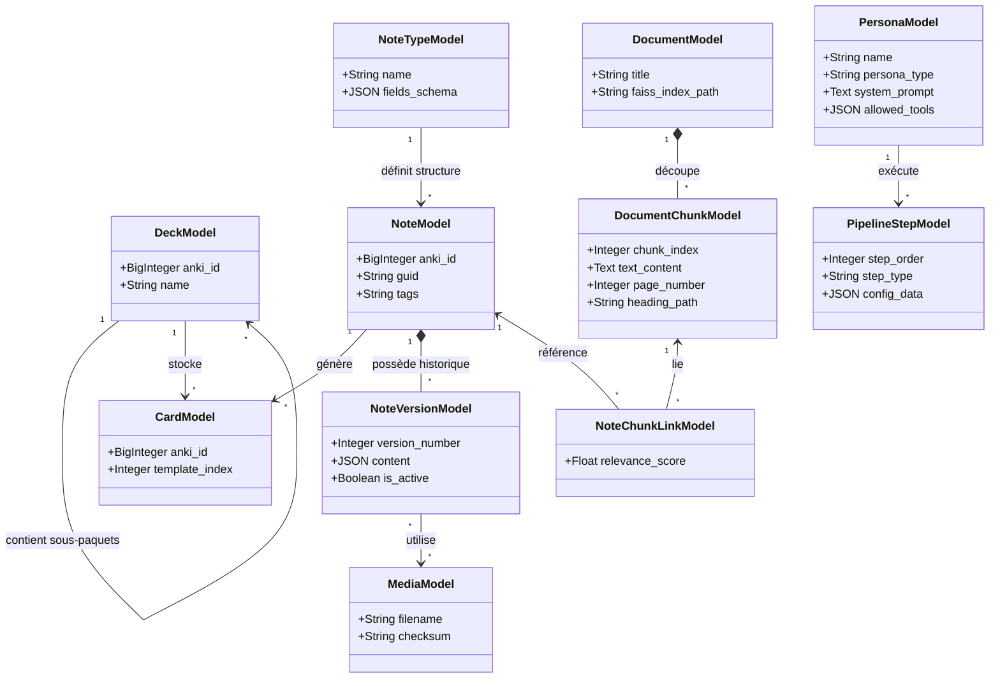
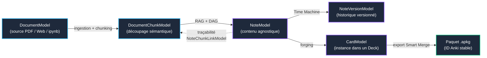

# Modèle de Données et Synchronisation (AnkiForge)

## 1. Modélisation de la Base de Données (Peewee)
AnkiForge reproduit intelligemment la structure relationnelle d'Anki, optimisée pour l'analyse et la forge. La base SQLite locale gérée par `peewee` repose sur les piliers suivants :

* **Cartes, Notes & Médias (`models/cards.py`) :**
  * `NoteTypeModel` : Définition des gabarits HTML/CSS et schémas de champs (Recto, Verso, Extra).
  * `NoteModel` : Contenu textuel et multimédia agnostique du paquet de destination. `note_type` en FK `ON DELETE RESTRICT` (un type de note utilisé ne se supprime jamais silencieusement).
  * `CardModel` : Instanciation physique d'une note dans un paquet avec état d'apprentissage.
  * `DeckModel` : Arborescence hiérarchique des paquets Anki. `parent_deck` en FK `ON DELETE CASCADE` (sémantique native Anki : un sous-deck et ses cartes suivent leur parent).
  * `MediaModel` & `NoteVersionMediaModel` : Gestion dédupliquée des médias par checksum SHA-256. La liaison média est en FK `ON DELETE RESTRICT` (un média référencé n'est jamais supprimé ; le nettoyage passe par le `media_manager` qui désassocie d'abord).
  * `NoteVersionModel` : Historique Time Machine des modifications de chaque note.
* **Documents & RAG Local (`models/rag.py`) :**
  * `FolderModel` : Organisation arborescente des documents sources.
  * `DocumentModel` : Métadonnées du document source et chemin de l'index vectoriel.
  * `DocumentPageModel` : Pagination et métadonnées par page (numérotation, titres).
  * `DocumentChunkModel` : Découpage sémantique avec préservation du chemin de titres (`heading_path`). `is_profiled` est un booléen non-nullable (état dichotomique clair pour la couverture RAG), `media` en FK `ON DELETE SET NULL`.
  * `NoteChunkLinkModel` : Ancrage déterministe entre notes générées et fragments documentaires.
  * `EmbeddingCacheModel` : Cache persistant des vecteurs d'embeddings par hash de contenu pour éviter les recalculs.
* **Intelligence Artificielle & Personas (`models/ai.py`) :**
  * `PersonaFolderModel` : Arborescence récursive de répertoires d'agents pédagogiques.
  * `PersonaModel` : Profils spécialisés (`⚡ Pipeline`, `🤝 MCP`, `🌐 Universel`) avec prompts Jinja2 et permissions.
  * `PersonaVersionModel` : Versionnement et rollback des prompts et hyperparamètres des personas.
  * `PromptModel` : Bibliothèque de prompts modulaires réutilisables.
  * `LLMConfigModel` : Configurations d'inférence (fournisseur, température, context window).
  * `ConsultantSessionModel` & `ConsultantMessageModel` : Sessions conversationnelles interactives avec le consultant MCP.
* **Télémétrie & Coûts IA (`models/usage.py`) :**
  * `TokenUsageModel` : Télémétrie granulaire des jetons, temps d'inférence, coûts USD et contexte d'exécution. Vraies clés étrangères vers `PipelineModel` et `PersonaModel` (`ON DELETE SET NULL` via `column_name="pipeline_id"`/`persona_id`) : la suppression d'un pipeline ou d'un persona conserve l'historique de coûts.
* **Moteur d'Orchestration DAG (`models/pipelines.py`) :**
  * `PipelineModel` : Définition des graphes de génération et d'audit.
  * `PipelineStepModel` : Étapes typées (`LLM_PROMPT`, `RAG_RETRIEVAL`, `MAP_REDUCE`, `HUMAN_VALIDATION`, `PYTHON_TOOL`) et branchements.
  * `PythonToolModel` : Outils déterministes et scripts Python persistés en sandbox.
* **Audit Wozniak & Linter (`models/audit.py`) :**
  * `LinterRuleModel` : Règles de formulation (20 règles de Wozniak + règles métier catégorisées).
  * `AuditRecordModel` : Historique et traçabilité des anomalies détectées sur les cartes.
  * `IgnoredDuplicateModel` : Faux positifs et paires de doublons expressément ignorés par l'utilisateur.
* **Système, Tâches & Cache (`models/system.py`) :**
  * `SettingModel` : Préférences et clés de configuration applicative persistées.
  * `JobModel` : Suivi d'avancement des tâches asynchrones en arrière-plan (`QThreadPool`).
  * `AICacheModel` : Cache déterministe clé/valeur des complétions LLM pour limiter les coûts API.

### Cycle de Vie d'une Connaissance
Du document source jusqu'à la flashcard Anki, une connaissance transite par 6 états tracés :

## 2. Le Cycle de Synchronisation (Workflow `.apkg`)
AnkiForge fonctionnant de manière isolée ("Air-gapped"), le transfert de données se fait via des archives compressées standard.
1. **Ingestion :** Import d'un `.apkg` (Paquet) ou `.colpkg` (Collection complète). AnkiForge mappe les IDs uniques d'Anki avec ses IDs internes.
2. **Forge :** L'utilisateur modifie, audite, et crée des cartes.
3. **Éjection :** Export d'un nouveau `.apkg` ciblé contenant uniquement les ajouts et les mises à jour, prêt à être double-cliqué pour s'intégrer dans Anki.

## 3. Gestion Intelligente des Conflits (Le Smart Merge)
C'est la fonctionnalité phare pour les Power Users. Lors d'un import, AnkiForge compare la base entrante avec sa base locale. Contrairement à Anki qui écrase brutalement selon la date, AnkiForge déploie un outil de résolution de conflits précis.

### A. Critères stricts de déclenchement d'un conflit
L'application ne lève une alerte de conflit **que si, et seulement si, le contenu textuel/HTML des champs d'une Note a été modifié des deux côtés**.
* **Ce qui déclenche un conflit :** La modification du texte du Recto, la correction d'une faute de frappe, l'ajout d'une image dans le Verso.
* **Ce qui est ignoré (Pas de conflit) :**
  * Le déplacement de la carte vers un autre paquet (Deck).
  * La modification des statistiques de révision (Ease factor, intervalles).
  * Ces métadonnées sont fusionnées silencieusement (AnkiForge garde le contenu forgé, mais accepte le nouveau Deck entrant si pertinent).

### B. L'Interface de Résolution (Merge Dialog 3-Panneaux)
Si un vrai conflit de contenu est détecté, l'utilisateur n'est pas bloqué, mais une modale façon "IDE de développement" s'ouvre :
1. **Panneau Gauche (Base Locale Forge) :** Affiche la note telle qu'elle a été travaillée dans AnkiForge.
2. **Panneau Droit (Base Entrante Anki) :** Affiche la note provenant du fichier `.apkg` importé.
3. **Panneau Central (Résultat Fusionné) :** Un éditeur interactif avec mise en évidence des différences (diff highlighting) permettant d'accepter les ajouts de gauche ou de droite, ligne par ligne.

Cette approche garantit qu'**aucune connaissance n'est écrasée par erreur**, tout en rendant le processus indolore si la carte a simplement été déplacée de dossier.
