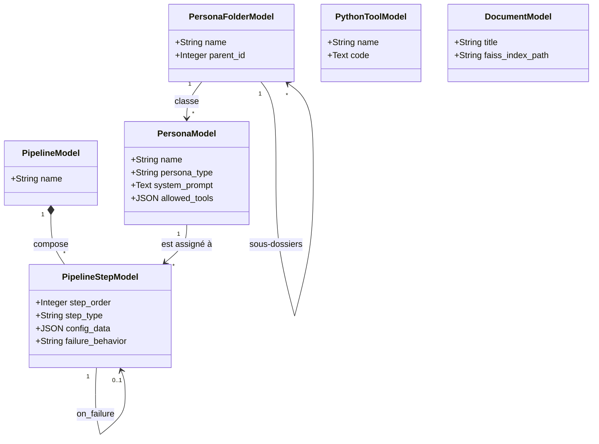

# Moteur d'Orchestration IA & Architecture Détaillée

Pour répondre aux contraintes du traitement massif (LLM locaux avec fenêtres de contexte limitées) et offrir une flexibilité totale, l'architecture IA d'AnkiForge s'appuie sur un **Moteur de Workflow Orienté Graphe (DAG) avec Map-Reduce, RAG natif et Pause Copilote**.

## 1. Schéma de Données (Le Moteur de Pipeline)

Le schéma Peewee supporte nativement des graphes d'exécution, des permissions d'outils et des configurations dynamiques.

### A. PersonaModel
Définit un rôle IA enrichi de capacités et d'outils :
* `name`, `system_prompt`, `output_format`
* `persona_type` : Portée de l'agent (`pipeline`, `mcp`, `universal`).
* `folder` : Clé étrangère vers `PersonaFolderModel` pour l'organisation arborescente récursive.
* `allowed_tools` (JSON) : Liste des fonctions et outils MCP/Python que cette Persona a le droit d'appeler (ex: `["query_peewee", "get_deck_stats", "clean_html_latex"]`).
* `llm_config_id` : Clé étrangère pour assigner un modèle dédié (ex: forcer un gros modèle cloud pour l'Architecte et un petit modèle local rapide pour le Linter).

### B. PipelineStepModel
Chaque étape du pipeline possède un `step_type` déterministe et une configuration dynamique `config_data` :
1. **`LLM_PROMPT`** : Appel standard à une Persona avec injection de variables Jinja2.
2. **`RAG_RETRIEVAL`** : Recherche sémantique pure interrogeant l'index vectoriel FAISS/ChromaDB et injectant les fragments pertinents dans le *State*.
3. **`MAP_REDUCE`** : Exécute une sous-étape sur chaque élément d'une collection en parallèle (`QThreadPool`), puis fusionne les résultats.
4. **`HUMAN_VALIDATION`** : Met le pipeline en pause. Le *State* actuel est transmis à la modale interactive `HumanValidationDialog` pour validation humaine avant reprise (`resume()`).
5. **`PYTHON_TOOL`** : Exécution d'un outil Python déterministe (`ToolService`) avec entrées/sorties typées.

### C. State Management (Contexte & Mémoire partagée)
Les étapes s'échangent un objet **`PipelineRunState`** (dictionnaire JSON en mémoire) qui s'enrichit au fil de l'exécution :
* *Exemple :* L'étape 1 écrit dans `state["pdf_chunks"]`. L'étape 2 (MapReduce) lit `state["pdf_chunks"]` et écrit dans `state["draft_cards"]`.

---

## 2. Implémentation du RAG (Vectorisation Locale)

* **Vector Store Local :** Utilisation de **FAISS** ou **ChromaDB** embarqué sans serveur lourd externe.
* **Ingestion (Pipeline de Document) :**
  1. L'utilisateur importe une source (PDF, Markdown, URL, vidéo YouTube).
  2. *Marker OCR* ou le parseur extrait le texte brut.
  3. Le texte est découpé par **Semantic Chunking** (`ChunkingService`) préservant numéros de pages et arborescence de titres.
  4. Les fragments sont vectorisés via un modèle d'embedding local (Ollama) ou cloud.
  5. Les vecteurs sont persistés dans l'index FAISS local (`RAGService`, `VectorManager`), et `DocumentChunkModel` stocke les métadonnées relationnelles.

---

## 3. Architecture par Module

### 📚 A. Module Documents (Ingestion & Base de Connaissances)
* **Porte d'entrée :** `documents_view.py`.
* **Délimitation :** Modale `DocumentDelimitationDialog` permettant de définir des plages de pages ou chapitres utiles.
* **Statut Live :** Badges FAISS réactifs (`🟢 Indexé FAISS` / `⏳ Non indexé`) et modale de test sémantique `RAGTestDialog`.
* **Traçabilité :** Calcul du taux de couverture documentaire et bouton "⚡ Forger la section" direct.

### 🏭 B. Module Création & Pipelines (Génération DAG)
* **Orchestration :** Exécution asynchrone pilotée par `PipelineOrchestrator` dans `QThreadPool`.
* **Copilote Interactif :** Interception du signal `human_validation_required` avec la boîte `HumanValidationDialog` pour éditer les concepts extraits avant de relancer l'orchestrateur.
* **Mappage de Modèles :** Résolution automatique des champs selon le schéma du `NoteTypeModel`.

### 🏥 C. Module Analyse & Audit (L'Hôpital)
* **Linter Wozniak & Règles Custom :** Modèle `LinterRuleModel`, 20 règles de formulation + règles utilisateur par catégories (`cat-atomicite`, `cat-interferences`, etc.), inspecteur comparatif 5 champs et scission/mutation en 1-clic.
* **Matrice de Doublons & Fusion :** Détection hybride (Levenshtein natif C + FAISS vectoriel), boîte de dialogue de fusion (Merge Dialog) à 3 colonnes.
* **Diagnostic Sources & Gap Analysis :** Analyse des lacunes de couverture via `NoteChunkLinkModel` et génération ciblée des cartes manquantes.

### 🤖 D. Module Consultant (Agent ReAct Autonome)
* **Moteur ReAct :** Boucle autonome (*Thought ➔ Action ➔ Observation ➔ Response*).
* **Serveur MCP In-Process :** Registre d'outils sécurisés (`query_peewee`, `get_deck_stats`, `get_cards_by_deck_or_tag`, `update_card_model_css`, `execute_python_tool`).
* **Widgets Riches :** `ThoughtStepWidget`, `ToolCallWidget`, `ChatMessageWidget` avec prévisualisation et application directe.

### 🎨 E. Module Modèles de Cartes (Atelier & Tests A/B)
* **Atelier de Modèles :** Édition HTML/CSS/Jinja2 avec aperçu temps réel WebEngine.
* **Laboratoire A/B :** 3 modes de comparaison simultanés (Modèle vs Modèle, Prompt vs Prompt, Pipeline vs Pipeline), exécution concurrente multithread, bannière de KPIs en direct et import 1-clic dans la Forge.

---

## 4. Spécifications des Vues Connectées au DAG

### 📋 1. Vue Pipelines d'Exécution (`pipelines_view.py`)
1. **Actions Système & Agents IA :** Support transparent de `LLM_PROMPT`, `RAG_RETRIEVAL`, `MAP_REDUCE`, `HUMAN_VALIDATION`, `PYTHON_TOOL`.
2. **Inspecteur Maître-Détail JetBrains :** `StepInspectorPanel` isolé dans une `QScrollArea` avec gestion des paramètres contextuels et configuration dynamique `config_data`.
3. **Système d'Outils Python Déterministes :** Éditeur intégré `ToolEditorDialog`, outils intégrés (`clean_html_latex`, `deduplicate_cards_levenshtein`, `validate_json_schema`, `compute_stats_and_metrics`) et persistance `PythonToolModel`.
4. **Badges de Rôle Visuels :** 🔵 `RAG`, 🟣 `LLM`, 🟡 `PAUSE (Copilote)`, 🟢 `MAP-REDUCE`, 🟠 `OUTIL PYTHON`.

### 🧑‍💻 2. Vue Éditeur d'Agents (`agents_view.py`)
1. **Arborescence Récursive (`PersonaFolderModel`) :** Dossiers et sous-dossiers illimités avec méthode `get_full_path()`.
2. **Portée & Types de Personas :** Filtrage instantané `⚡ Pipeline`, `🤝 MCP`, `🌐 Universel`.
3. **Éditeur Riche 3 Onglets :** Identité & Dossier, Prompt Jinja2 avec palette de snippets contextuels en 1-clic, Grille de permissions d'outils MCP & Python.
4. **Modale de Test Unitaire :** `AgentTestDialog` avec simulation en direct.

### 🤖 3. Vue Consultant IA (`consultant_view.py`)
1. **Moteur ReAct Autonome :** Boucle de raisonnement continue avec auto-correction.
2. **Serveur MCP Interne :** Exposition standardisée d'outils backend sécurisés.
3. **Composants d'IHM Riches :** Affichage interactif des résultats SQL, statistiques de rétention et boutons d'action rapide.
4. **Injection Directe de Styles :** Modification instantanée du CSS des modèles de notes et rechargement de l'aperçu WebEngine.

### 🧪 4. Vue Laboratoire de Tests A/B (`ab_tests_view.py`)
1. **Comparaison Tri-Mode :** Modèle vs Modèle, Prompt vs Prompt, Pipeline vs Pipeline.
2. **Exécution Concurrente Symétrique :** Deux instances de `PipelineOrchestrator` en parallèle via `QThreadPool`.
3. **Bannière KPIs en Direct :** Durée (⏱️), cartes générées (🃏), tokens consommés (🪙), coût en USD (💰).
4. **Affichage Symétrique :** Rendu Cartes, Tableau des Champs, JSON Brut, et Import 1-Clic dans la Forge.

### 🏭 5. Vue Studio de Création (`creation_view.py`)
1. **Pilotage Asynchrone :** Connexion complète aux signaux de `PipelineOrchestrator`.
2. **Modale Interactive de Copilote :** Affichage de `HumanValidationDialog` lors d'une étape `HUMAN_VALIDATION` pour ajustement et reprise fluide (`resume()`).
3. **Mappage Automatique des Champs :** Détection et structuration des champs selon le modèle de note sélectionné.
