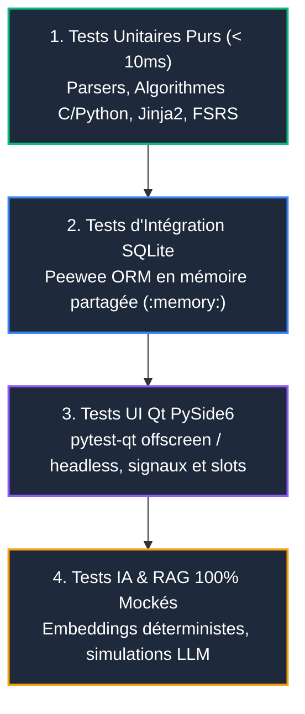

# Tests Automatisés & Intégration Continue (CI/CD) 🧪

AnkiForge dispose d'une suite de plus de 600 tests automatisés garantissant la non-régression, la stabilité sous charge et la compatibilité multi-systèmes.

---

## 🏛️ 1. La Pyramide de Tests

Les tests sont strictement compartimentés en 4 strates étanches :



### 1. Tests Unitaires Purs (< 10ms par test)
- Couvrent les algorithmes critiques : distance de Levenshtein (C natif et fallback Python), extraction mathématique KaTeX, calculs d'intervalles FSRS, templating Jinja2.
- **Règle absolue** : Zéro accès BDD, zéro appel réseau, zéro widget Qt instancié.

### 2. Tests d'Intégration BDD & Services
- Utilisent une base de données SQLite en mémoire partagée (`mode=memory&cache=shared`).
- Testent l'intégrité référentielle des modèles Peewee (`NoteModel`, `CardModel`, `PersonaModel`, `DeckModel`).

### 3. Tests UI Qt Headless (`pytest-qt`)
- Pilotés par la fixture `qtbot` en mode offscreen (sans ouverture de fenêtres réelles).
- Testent la mécanique événementielle : émission des signaux Qt, capture des clics boutons, validation de formulaires et cycle de vie des dialogues.
- **Interdiction des snapshots visuels** : Évite les faux positifs liés aux différences de rendu de polices entre macOS, Linux et Windows.

### 4. Tests IA Déterministes & Mocks
- **Zéro appel API payant** en CI ou en local : tous les retours d'OpenAI, Gemini, Anthropic et Ollama sont mockés de manière prévisible.

---

## ⚡ 2. Exécution Rapide en Local (`pytest-xdist`)

Grâce à la parallélisation native multi-cœurs via `pytest-xdist`, l'ensemble des 600+ tests s'exécute en une dizaine de secondes :

```bash
# Lancer tous les tests en parallèle sur tous les cœurs CPU
uv run pytest

# Lancer un sous-ensemble de tests spécifique
uv run pytest tests/test_tts_service.py

# Afficher la couverture de code détaillée
uv run pytest --cov=ankiforge --cov-report=term-missing
```

---

## 🌐 3. Pipeline CI/CD GitHub Actions

Chaque commit et pull request déclenche un pipeline d'intégration continue multi-plateformes :
- **Matrice Multi-OS** : Exécution conjointe sur `macos-latest`, `ubuntu-latest` et `windows-latest`.
- **Compilation C Native** : Compilation de `levenshtein_distance.c` via le compilateur hôte.
- **Jobs Bloquants** :
  1. `Linting` : `ruff check` et `ruff format --check`.
  2. `Typage` : `mypy src/ankiforge` (stricte conformité exigée).
  3. `Sécurité` : Audit des vulnérabilités statiques avec `bandit`.
  4. `Tests` : Suite `pytest` complète avec rapport de couverture.
