# Consultant IA Autonome & Serveur MCP 🤝

Le **Consultant IA** d'AnkiForge est bien plus qu'un simple chatbot textuel : c'est un agent d'ingénierie autonome capable d'interagir directement avec votre base de données locale, d'auditer vos modèles et d'effectuer des opérations complexes sur votre collection grâce au protocole **MCP** (*Model Context Protocol*).

---

## 🧠 1. La Boucle ReAct (*Thought ➔ Action ➔ Observation*)

Le consultant s'appuie sur le paradigme **ReAct** (Reasoning + Acting) pour résoudre vos demandes étape par étape :

```mermaid
sequenceDiagram
    autonumber
    actor User as Utilisateur
    participant Agent as Consultant IA (ReAct)
    participant MCP as Serveur MCP In-Process
    participant DB as SQLite (Peewee ORM)

    User->>Agent: "Trouve les cartes avec le tag #anatomie et ajoute le tag #médecine"
    rect rgb(30, 41, 59)
        Agent->>Agent: Thought: Je dois interroger les cartes portant le tag #anatomie
        Agent->>MCP: Action: get_cards_by_deck_or_tag(tag="anatomie")
        MCP->>DB: Query Peewee ORM
        DB-->>MCP: 14 cartes retournées
        MCP-->>Agent: Observation: Liste des 14 cartes avec leurs IDs
    end
    rect rgb(15, 23, 42)
        Agent->>Agent: Thought: Maintenant je dois ajouter le tag #médecine à chacune
        Agent->>MCP: Action: query_peewee(update query)
        MCP->>DB: Commit SQLite
        DB-->>MCP: 14 lignes mises à jour
        MCP-->>Agent: Observation: Succès
    end
    Agent-->>User: "14 cartes ont été mises à jour avec succès avec le tag #médecine !"
```

### Visualisation Graphique des Étapes
Dans l'interface du consultant, chaque étape est matérialisée par des widgets interactifs :
- **`ThoughtStepWidget`** : Panneau dépliable affichant la chaîne de pensée (*Chain of Thought*) de l'agent.
- **`ToolCallWidget`** : Carte visuelle indiquant l'outil invoqué, ses arguments JSON et le résultat renvoyé par le système.
- **`ChatMessageWidget`** : Message final élégamment formaté en Markdown avec support des blocs de code et des tableaux.

---

## 🛠️ 2. Boîte à Outils MCP In-Process

AnkiForge intègre un serveur MCP local (`ankiforge.services.ai.mcp_server`) exposant des outils outillés et sécurisés :

| Outil MCP | Rôle & Capacités | Sécurité & Garde-fous |
| :--- | :--- | :--- |
| `get_deck_stats` | Récupère le nombre de cartes, paquets, tags et modèles actifs. | Lecture seule. |
| `get_cards_by_deck_or_tag` | Recherche filtrée par paquet, tag ou texte partiel. | Lecture seule, pagination automatique. |
| `query_peewee` | Exécute des requêtes de consultation ou de modification de la base SQLite. | Transactionnelle avec rollback automatique en cas d'erreur. |
| `update_card_model_css` | Modifie le style CSS d'un modèle de carte en direct. | Validation syntaxique du CSS avant enregistrement. |
| `execute_python_tool` | Lance des calculs ou des transformations Python sur mesure. | Environnement isolé. |

---

## 🎯 3. Compaction de Contexte & Personas

Pour éviter la saturation de la fenêtre de contexte du LLM lors de longues sessions de travail :
- **Compaction Automatique** : Le gestionnaire résume les observations passées des outils MCP tout en conservant les conclusions critiques.
- **Personas Dédiés** : Vous pouvez affecter un **Persona** spécialisé au consultant (ex. *Spécialiste Médical*, *Linguiste Japonais*, *Architecte CSS Anki*) doté d'instructions système et de règles métiers spécifiques.
