# Consultant IA Autonome & Serveur MCP 🤝

Le **Consultant IA** d'AnkiForge est bien plus qu'un simple chatbot textuel : c'est un agent d'ingénierie autonome capable d'interagir directement avec votre base de données locale, d'auditer vos modèles et d'effectuer des opérations complexes sur votre collection grâce au protocole **MCP** (*Model Context Protocol*).

---

## 🧠 1. La Boucle ReAct (*Thought ➔ Action ➔ Observation*)

Le consultant s'appuie sur le paradigme **ReAct** (Reasoning + Acting) pour résoudre vos demandes étape par étape :

```mermaid
sequenceDiagram
    autonumber
    actor User as Utilisateur
    participant Agent as Consultant IA (ReAct)
    participant MCP as Serveur MCP In-Process
    participant DB as SQLite (Peewee ORM)

    User->>Agent: "Trouve les cartes avec le tag #anatomie et ajoute le tag #médecine"
    rect rgb(30, 41, 59)
        Agent->>Agent: Thought: Je dois interroger les cartes portant le tag #anatomie
        Agent->>MCP: Action: get_cards_by_deck_or_tag(tag="anatomie")
        MCP->>DB: Query Peewee ORM
        DB-->>MCP: 14 cartes retournées
        MCP-->>Agent: Observation: Liste des 14 cartes avec leurs IDs
    end
    rect rgb(15, 23, 42)
        Agent->>Agent: Thought: Maintenant je dois ajouter le tag #médecine à chacune
        Agent->>MCP: Action: query_peewee(update query)
        MCP->>DB: Commit SQLite
        DB-->>MCP: 14 lignes mises à jour
        MCP-->>Agent: Observation: Succès
    end
    Agent-->>User: "14 cartes ont été mises à jour avec succès avec le tag #médecine !"
```

### Visualisation Graphique des Étapes
Dans l'interface du consultant, chaque étape est matérialisée par des widgets interactifs :
- **`ThoughtStepWidget`** : Panneau dépliable affichant la chaîne de pensée (*Chain of Thought*) de l'agent.
- **`ToolCallWidget`** : Carte visuelle indiquant l'outil invoqué, ses arguments JSON et le résultat renvoyé par le système.
- **`ChatMessageWidget`** : Message final élégamment formaté en Markdown avec support des blocs de code et des tableaux.

---

## 🛠️ 2. Boîte à Outils MCP In-Process

AnkiForge intègre un serveur MCP local (`ankiforge.services.ai.mcp_server`) exposant des outils outillés et sécurisés :

| Outil MCP | Rôle & Capacités | Sécurité & Garde-fous |
| :--- | :--- | :--- |
| `get_deck_stats` | Récupère le nombre de cartes, paquets, tags et modèles actifs. | Lecture seule. |
| `get_cards_by_deck_or_tag` | Recherche filtrée par paquet, tag ou texte partiel. | Lecture seule, pagination automatique. |
| `query_peewee` | Exécute des requêtes de consultation ou de modification de la base SQLite. | Transactionnelle avec rollback automatique en cas d'erreur. |
| `update_card_model_css` | Modifie le style CSS d'un modèle de carte en direct. | Validation syntaxique du CSS avant enregistrement. |
| `execute_python_tool` | Lance des calculs ou des transformations Python sur mesure. | Environnement isolé. |
| `search_app_documentation` | Recherche plein-texte BM25 avec extraits dans toute la doc Zensical. | SQLite FTS5 en mémoire, zéro dépendance réseau. |
| `read_app_doc_page` | Lit l'intégralité d'une page de documentation ou une section ciblée par ancre. | Lecture seule des sources `docs/`. |
| `list_app_doc_topics` | Retourne le sommaire structuré classé par thèmes et chapitres Zensical. | Arborescence déduite de `zensical.toml`. |
| `get_feature_quick_help` | Fiche synthétique d'une fonctionnalité clé (Ollama, KaTeX, DAG, Wozniak, etc.). | Extraction déterministe avec citation de source. |

---

## 📚 3. Base de Connaissances Interne (Zensical & SQLite FTS5)

Pour éviter les hallucinations et permettre au Consultant de guider l'utilisateur sur l'usage d'AnkiForge, le serveur MCP intègre une base de connaissances alimentée par la documentation Zensical :
- **Indexation FTS5 Instantanée** : Ingestion des 30+ pages Markdown de `docs/` avec découpage sémantique par sections H1/H2/H3 et génération d'ancres en moins de 15 ms.
- **Ressources MCP Directes** : Exposition des URI de ressources standard `docs://topics` (sommaire complet) et `docs://page/{doc_path}` (contenu brut Markdown) pour les clients externes comme Claude Desktop ou Cursor.
- **Prompts MCP Contextuels** : Modèles d'assistance prédéfinis `explain_ankiforge_feature` et `audit_architecture_compliance`.

---

## 🤖 4. Gestion des Agents Dédiés via le Protocole MCP

AnkiForge permet désormais de gérer, d'explorer et d'invoquer des agents spécialisés directement depuis des clients MCP externes (Cursor, Claude Desktop) ou depuis le Consultant interne :

### Outils de Gestion d'Agents
- **`list_mcp_agents(include_all_scopes)`** : Retourne la liste complète des agents configurés avec leur type, modèle, description et nombre d'outils autorisés.
- **`get_mcp_agent_details(agent_name)`** : Inspecte le prompt système complet, les hyperparamètres et la liste exhaustive des permissions d'un agent.
- **`invoke_mcp_agent(agent_name, prompt, max_iterations)`** : Exécute une mission en déléguant l'inférence à l'agent spécifié, sous son persona et dans la limite stricte de ses outils autorisés.
- **`create_or_update_mcp_agent(name, system_prompt, ...)`** : Crée ou met à jour programmatiquement un persona dédié depuis un client MCP.

### Ressources & Prompts MCP Dédiés
- **Ressources** :
  - `agents://list` : Catalogue JSON de tous les agents disponibles.
  - `agents://{agent_name}` : Spécification détaillée et prompt d'un agent particulier.
- **Prompts** :
  - `run_with_agent` : Prépare une session de travail sous l'identité d'un agent sélectionné.

---

## 🎯 5. Compaction de Contexte, Badges UI & Personas

Pour éviter la saturation de la fenêtre de contexte du LLM lors de longues sessions de travail :
- **Compaction Automatique** : Le gestionnaire résume les observations passées des outils MCP tout en conservant les conclusions critiques.
- **Affichage Visuel dans `ContextHubWidget`** :
  - **Badge Persona** : Indique l'agent actif (ex: `🛡️ Auditeur Wozniak`, `🎨 Architecte CSS`).
  - **Badge Outils Autorisés** : Affiche le quota d'outils disponibles (ex: `8 outils` ou `Tous outils`) avec infobulle détaillée des permissions actives.
  - **Basculement Dynamique** : L'utilisateur ou le client MCP peut basculer d'agent à tout moment, adaptant instantanément les capacités et le prompt système du consultant.
