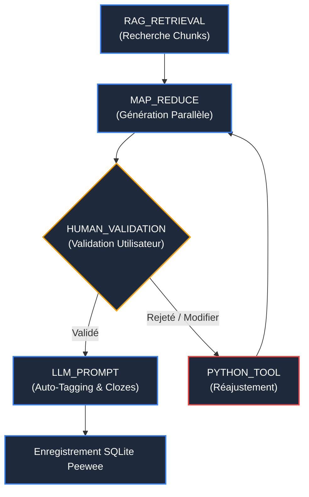

# Moteur DAG & RAG Hybride ⚡

L'automatisation avancée dans AnkiForge s'articule autour de deux briques architecturales majeures : le **Moteur de Pipelines DAG** pour orchestrer les flux de traitement multi-étapes et le **RAG Hybride** pour ancrer fidèlement les cartes dans vos documents sources.

---

## 🔄 1. L'Orchestrateur de Pipelines DAG

Plutôt qu'un appel LLM monolithique en "boîte noire", AnkiForge utilise un **graphe acyclique dirigé (DAG)** piloté par `PipelineOrchestrator` et son état partagé `PipelineRunState`.

### Les 5 Types d'Étapes Prises en Charge

1. **`LLM_PROMPT`** : Invoque un modèle d'IA avec un prompt Jinja2 contextualisé et des variables dynamiques.
2. **`RAG_RETRIEVAL`** : Interroge la base vectorielle locale pour injecter les fragments de texte les plus pertinents.
3. **`MAP_REDUCE`** : Découpe une liste de fragments volumineuse pour les traiter en parallèle (`map`), puis agrège et déduplique les cartes produites (`reduce`).
4. **`HUMAN_VALIDATION`** : Suspend proprement l'exécution du DAG et ouvre une boîte de dialogue interactive (`HumanValidationDialog`) où l'utilisateur peut approuver, corriger ou rejeter les cartes avant de poursuivre.
5. **`PYTHON_TOOL`** : Exécute une routine Python personnalisée (nettoyage de balises HTML, calculs statistiques, regex).

### Sauts Conditionnels et Résilience
Chaque nœud du DAG peut définir une règle de branchement dynamique :
- `on_success_step` : Nœud cible en cas d'exécution réussie.
- `on_failure_step` : Nœud cible en cas d'erreur ou d'invalidation (permettant des boucles d'auto-critique et de self-healing).

---

## 🔍 2. RAG Hybride (FAISS + BM25 avec RRF)

Le moteur de recherche documentaire d'AnkiForge combine deux approches complémentaires pour éliminer les hallucinations :

### La Double Indexation
- **Recherche Dense (Vectorielle - FAISS / ChromaDB)** : Capture le sens sémantique profond, les analogies et les synonymes via des vecteurs d'embeddings locaux ou distants.
- **Recherche Clairsemée (Lexicale - BM25)** : Garantit la correspondance exacte sur les termes techniques rares, les noms propres, les acronymes et la terminologie scientifique.

### Fusion de Rang Réciproque (*Reciprocal Rank Fusion* - RRF)
Les scores bruts vectoriels et BM25 ne peuvent être simplement additionnés (leurs distributions statistiques sont divergentes). AnkiForge applique l'algorithme mathématique **RRF** pour classer les fragments :

$$\text{Score RRF}(d) = \sum_{m \in \{\text{dense}, \text{lexical}\}} \frac{1}{k + r_m(d)}$$

où $r_m(d)$ est le rang du document dans la liste du modèle $m$ et $k=60$ est une constante de régularisation. Les fragments qui se classent bien à la fois en sémantique et en mots-clés exacts remontent immédiatement en tête.

---

## 🧪 3. Modale de Test RAG (`RAGTestDialog`)

Pour calibrer la recherche sans devoir lancer un pipeline complet, AnkiForge met à disposition la boîte de dialogue de test instantané :
- Saisissez une requête utilisateur.
- Obtenez en direct les chunks sélectionnés avec leurs scores RRF, la distance cosinus et les surlignages contextuels.
- Ajustez le nombre de fragments (*Top-K*) et le seuil de similarité en direct.
