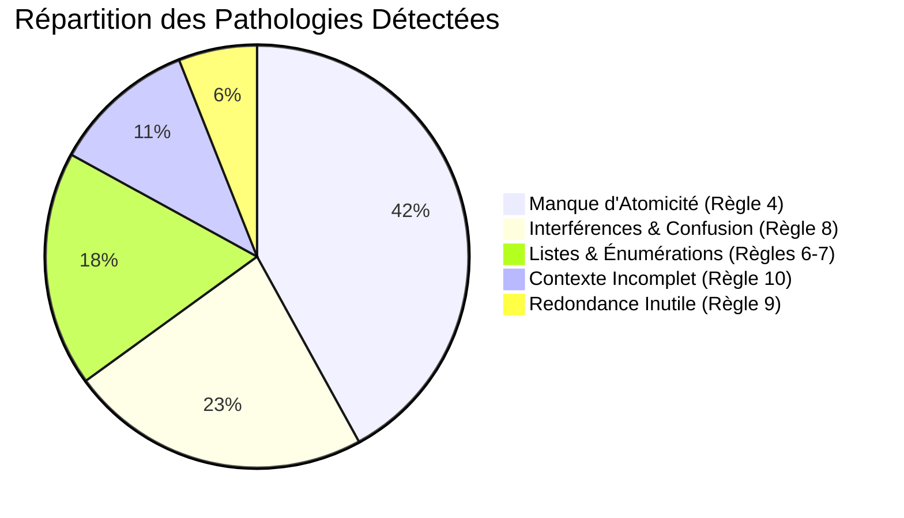

# Linter Wozniak & Hôpital d'Audit 🏥

Le plus grand danger lors de la création de flashcards avec l'IA est l'illusion de compétence : générer des centaines de cartes verbeuses, complexes ou interconnectées qui entraînent une saturation rapide de la mémoire et des échecs massifs lors des révisions espacées.

AnkiForge intègre un outil unique : le **Linter Wozniak** et son **Hôpital d'Audit**, conçus pour diagnostiquer et soigner vos cartes.

---

## 📖 1. Les 20 Règles de Piotr Wozniak

Le moteur d'audit applique rigoureusement les principes cognitifs établis par **Piotr Wozniak** (pionnier des algorithmes de répétition espacée et créateur de SuperMemo) :

### Catégories de Diagnostics
- **Atomicité (`cat-atomicite`)** : La carte pose-t-elle une seule question élémentaire ? Une carte demandant 3 concepts simultanés échouera systématiquement lors des révisions à long terme.
- **Interférences (`cat-interferences`)** : Les questions se ressemblent-elles trop au point de créer une confusion mnésique ?
- **Listes et Énumérations (`cat-enumeration`)** : Tentative d'apprendre une liste ordonnée par cœur plutôt que de la décomposer en occlusions séquentielles.
- **Contexte Minimal (`cat-contexte`)** : La question fournit-elle suffisamment de contexte pour être univoque, sans nécessiter de deviner la pensée de l'auteur ?

---

## 🏥 2. L'Hôpital d'Audit

Dans l'onglet **Analyse & Audit**, les cartes de votre collection sont passées au crible :

### L'Inspecteur Comparatif à 5 Champs
Pour chaque carte diagnostiquée comme pathologique, l'inspecteur compare côte à côte :
1. **Texte Recto Original** vs **Recto Proposé par l'IA**
2. **Texte Verso Original** vs **Verso Proposé par l'IA**
3. **Tags d'Origine** vs **Tags Affinés**
4. **Diagnostic Wozniak** : Règle violée et explication pédagogique détaillée
5. **Score de Clarté** : Évaluation objective de la charge cognitive (sur 100)

---

## ⚡ 3. Actions Curatives en 1-Clic

L'interface de l'Hôpital d'Audit permet de corriger vos cartes sans aucune saisie manuelle :

### Scission de Carte en 1-Clic (*Split Card*)
Si une carte contient plusieurs faits distincts (violation de la règle 4 d'atomicité) :
- L'IA découpe la question complexe en **2 ou 3 cartes atomiques indépendantes**.
- En cliquant sur **Appliquer la Scission**, la carte originale est remplacée par les nouvelles cartes atomiques, garantissant une mémorisation sans effort.

### Mutation Concisée (*One-Click Mutation*)
Si la carte est valide mais formulée de manière trop lourde ou ambiguë :
- L'IA propose une reformulation ultra-concise préservant la précision sémantique.
- Un clic sur **Approuver la Mutation** met à jour la note dans la base SQLite locale.

> [!TIP]
> **Philosophie d'AnkiForge :** Le système ne supprime jamais aveuglément vos cartes. Chaque diagnostic vise à réparer, enrichir et élever la qualité pédagogique de vos connaissances.
