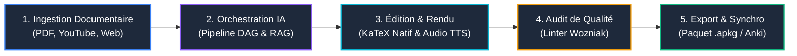

# Prise en Main Rapide ⚡

Ce tutoriel pas-à-pas vous guide dans la création, la validation et l'export de votre tout premier paquet de flashcards Anki avec AnkiForge en moins de 5 minutes.

---

## 🧭 Le Workflow en 5 Étapes

---

## 1. Premier Lancement & Gestion des Profils

Lorsque vous démarrez AnkiForge (`uv run ankiforge`) :
1. L'application charge le profil par défaut (`default`). Chaque profil dispose d'une base SQLite étanche (`~/.ankiforge/profiles/<nom>/ankiforge.db`) et d'un dossier de médias dédié.
2. L'interface s'ouvre dans un environnement multi-dock inspiré des IDEs JetBrains : les panneaux sont redimensionnables et détachables en fenêtres indépendantes.

---

## 2. Importer une Source dans le Hub Documentaire

1. Rendez-vous dans la vue **Hub Documentaire** (icône dossier dans la barre latérale).
2. Cliquez sur **Importer un document** :
   - **PDF** : Sélectionnez un fichier de cours ou un article de recherche. Le moteur `Marker` procède au découpage sémantique et extrait les formules mathématiques en LaTeX natif.
   - **Vidéo YouTube** : Collez simplement l'URL de la vidéo. AnkiForge télécharge les sous-titres officiels ou lance une transcription locale via Whisper.
   - **Page Web** : Entrez l'URL d'un article Wikipédia ou d'un blog technique pour en extraire un texte épuré sans publicités.
3. Le document apparaît dans votre bibliothèque avec son taux de couverture documentaire (*Smart Coverage*).

---

## 3. Générer des Flashcards via un Pipeline DAG

1. Ouvrez l'onglet **Création de Cartes** ou **Pipelines DAG**.
2. Choisissez le document source importé à l'étape précédente.
3. Sélectionnez un pipeline de génération (par exemple *Génération Conceptuelle & Clozes*).
4. Cliquez sur **Lancer le Pipeline** :
   - Le moteur DAG exécute les nœuds d'extraction, de découpage en chunks et d'appel LLM.
   - Si une étape de validation humaine (`HUMAN_VALIDATION`) est configurée, une boîte de dialogue interactive s'affiche pour vous permettre d'ajuster les propositions avant l'enregistrement définitif.

---

## 4. Affiner et Enrichir dans l'Éditeur Natif

Ouvrez la vue **Édition de Notes** :
- **Rendu Mathématique KaTeX Live** : Tapez vos formules entre `\( ... \)` pour les formules inline ou `\[ ... \]` pour les formules display. L'aperçu dynamique affiche immédiatement les équations avec KaTeX.
- **Gestionnaire de Textes à Trous (Clozes)** : Sélectionnez un mot-clé et pressez le raccourci ++ctrl+shift+c++ (ou ++cmd+shift+c++ sur macOS) pour créer une occlusion `{{c1::terme}}`.
- **Synthèse Vocale (TTS)** : Cliquez sur l'icône de microphone/haut-parleur dans la barre d'outils du champ pour générer instantanément l'audio vocal de la question ou de la réponse. La balise `[sound:tts_xxx.mp3]` est automatiquement intégrée.
- **Drapeaux de Couleur (Flags)** : Marquez les cartes prioritaires à l'aide des raccourcis ++ctrl+1++ à ++ctrl+7++ pour leur attribuer un drapeau Anki coloré.

---

## 5. Auditer les Cartes avec le Linter Wozniak

Avant d'exporter votre paquet, soumettez-le au contrôle de qualité pédagogique :
1. Ouvrez l'onglet **Analyse & Audit**.
2. Cliquez sur **Lancer l'Audit** : le moteur évalue les cartes selon les **20 règles de formulation des connaissances de Piotr Wozniak**.
3. Les cartes trop verbeuses ou présentant des interférences sont signalées avec un diagnostic précis :
   - Cliquez sur **Proposition IA** pour prévisualiser la version simplifiée ou scindée en plusieurs cartes atomiques.
   - Cliquez sur **Appliquer la Scission** pour convertir une carte complexe en 2 ou 3 cartes parfaitement atomiques.

---

## 6. Exporter vers Anki

1. Cliquez sur le bouton **Exporter en .apkg** dans la barre d'outils supérieure.
2. Choisissez le paquet Anki de destination et confirmez l'export.
3. Ouvrez le fichier généré dans l'application officielle Anki : vos cartes, médias, sons TTS, formules KaTeX et clozes sont immédiatement prêts pour vos révisions !
