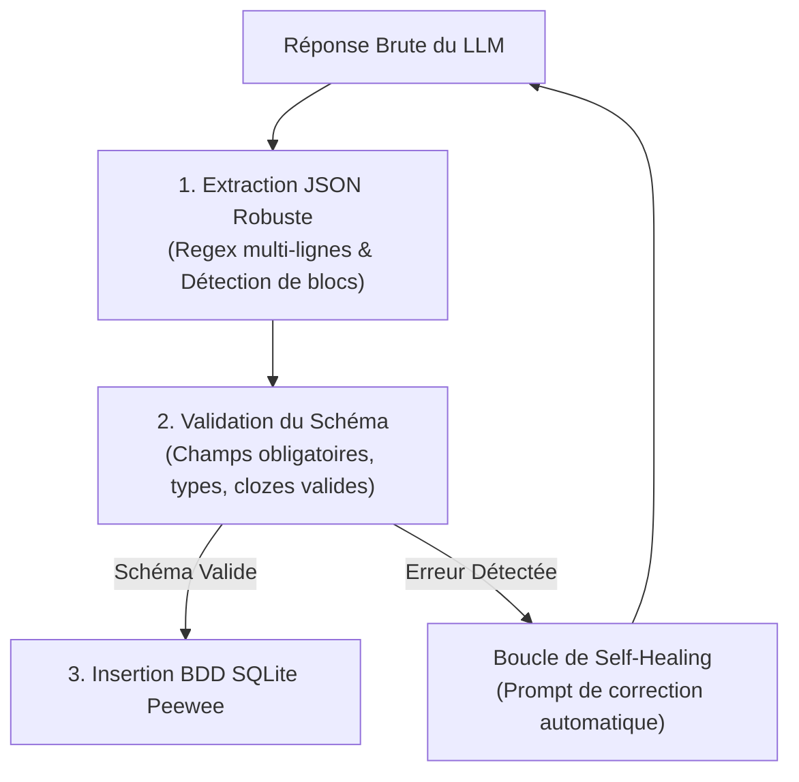

# Ingénierie de Prompts & Jinja2 🧠

Les prompts utilisés dans AnkiForge ne sont pas de simples chaînes de texte statiques. Ils reposent sur le moteur de templating **Jinja2** couplé à un **bouclier anti-hallucination** pour garantir des flashcards pédagogiquement irréprochables et techniquement exploitables.

---

## 🏗️ 1. Le Moteur de Templating Jinja2

Chaque étape d'inférence LLM dans un pipeline DAG ou un persona permet d'interpoler dynamiquement le contexte de la session d'apprentissage :

### Variables Globales Disponibles

| Variable Jinja2 | Type | Description |
| :--- | :--- | :--- |
| `{{ source_text }}` | `str` | Le fragment de document brut extrait (chunk ou texte délimité). |
| `{{ document_title }}` | `str` | Le titre ou nom de fichier de la source étudiée. |
| `{{ student_level }}` | `str` | Le niveau ciblé (ex: *Débutant*, *Licence*, *Internat de Médecine*). |
| `{{ target_deck }}` | `str` | Le paquet Anki de destination. |
| `{{ card_type }}` | `str` | Le format attendu (*Basique*, *Cloze*, *Mathématique*). |

### Exemple de Template Jinja2 Optimisé

```jinja2
Tu es un ingénieur pédagogique d'élite spécialisé dans les révisions espacées.
Source documentaire à analyser : "{{ document_title }}"

TEXTE SOURCE :
---
{{ source_text }}
---

CONSIGNES STRICTES DE FORMULATION :
1. Principe d'Atomicité (Règle de Wozniak) : Une carte = Un fait précis et un seul.
2. Pour les formules mathématiques, utilise exclusivement les délimiteurs \( ... \) ou \[ ... \].
3. Ne pose jamais de questions fermées nécessitant simplement "Oui" ou "Non".
4. Pour les listes ou étapes séquentielles, utilise obligatoirement des clozes imbriquées {{c1::terme}}.

Format de sortie attendu : Rends un objet JSON valide conforme au schéma demandé.
```

---

## 🛡️ 2. Le Bouclier Anti-Hallucination & Sorties Structurées

L'intelligence artificielle générative peut parfois dévier des consignes de format. AnkiForge déploie une triple barrière défensive :



1. **Extraction par Regex Multi-Lignes** : Même si le modèle ajoute des phrases de politesse ("*Voici les cartes au format JSON :*"), le parseur isole chirurgicalement le bloc JSON principal.
2. **Validation Schématique Stricte** : Chaque carte générée est inspectée : présence des champs `front` et `back`, cohérence des indices de cloze (`{{c1::...}}`), absence de balises HTML non autorisées.
3. **Boucle d'Auto-Guérison (*Self-Healing*)** : En cas de syntaxe JSON brisée (accolade manquante, virgule traînante), AnkiForge renvoie automatiquement l'erreur au modèle dans une requête corrective ultra-courte pour réparation immédiate sans intervention de l'utilisateur.
