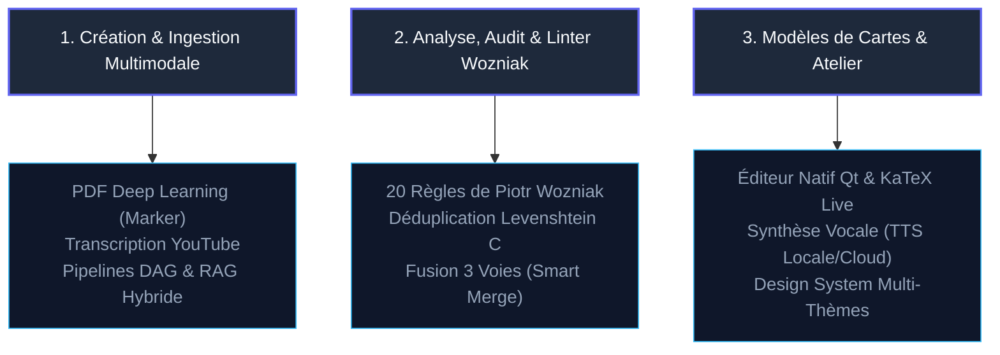

# Bienvenue sur AnkiForge 🛠️

**L'Atelier d'Ingénierie de la Connaissance et la Forge de Flashcards de Nouvelle Génération.**

AnkiForge est un environnement de développement intégré (IDE) de bureau surpuissant, conçu pour transformer n'importe quelle source d'apprentissage brute (**PDFs scientifiques, documents Word, présentations PowerPoint, vidéos YouTube, articles web**) en flashcards Anki d'une qualité pédagogique irréprochable.

---

## 🏛️ Les Trois Piliers Fondamentaux

AnkiForge adopte un positionnement strict de **Forge Pure** : l'apprentissage actif et les révisions espacées (SRS) restent 100% dans l'application officielle Anki. AnkiForge concentre toute sa puissance sur la création, le contrôle qualité et la personnalisation :

### 1. Ingestion Multimodale & Pipelines Intelligents
- **Deep Learning OCR** : Extraction haute précision de documents PDF avec restitution fidèle des tableaux et formules mathématiques LaTeX via `Marker`.
- **Sources Variées** : Ingestion native d'articles Web épurés (`trafilatura`), de fichiers Word/PowerPoint et de vidéos YouTube (sous-titres officiels ou transcription automatique par Whisper).
- **Moteur de Pipelines DAG** : Orchestration en graphe acyclique dirigé avec 5 types d'étapes (`LLM_PROMPT`, `RAG_RETRIEVAL`, `MAP_REDUCE`, `HUMAN_VALIDATION`, `PYTHON_TOOL`), sauts conditionnels et checkpoints interactifs.
- **RAG Hybride Local** : Indexation vectorielle FAISS/ChromaDB combinée à une recherche textuelle BM25 avec fusion de rang réciproque (*Reciprocal Rank Fusion* - RRF).

### 2. Audit de Qualité & Linter Wozniak
- **Les 20 Règles de Wozniak** : Analyse automatique de vos paquets de cartes selon les principes cognitifs fondamentaux de la mémorisation espacée (atomicité, interférences, redondance, contexte minimal).
- **Hôpital d'Audit** : Inspecteur comparatif SQLite vs proposition IA avec scission et mutation de cartes en un clic.
- **Détection de Doublons Haute Performance** : Moteur natif en C (`levenshtein_distance.c`) offrant une comparaison ultra-rapide des questions/réponses avec fallback pur Python.
- **Synchronisation & Smart Merge** : Dialogue de fusion à 3 panneaux inspiré des IDEs JetBrains pour importer et fusionner des fichiers `.apkg` et `.colpkg` sans écraser votre historique d'apprentissage.

### 3. Atelier de Modèles & Édition Native
- **Éditeur de Notes 100% Natif Qt** : Saisie mathématique en direct avec KaTeX offscreen, autocomplétion intelligente des macros LaTeX, gestionnaire de clozes (`{{c1::texte}}`) et drapeaux de couleur Anki (flags 1 à 7).
- **Synthèse Vocale (TTS) Embarquée** : Prise en charge d'Edge-TTS (14 voix studio) et de Piper TTS (moteur ONNX local ultra-rapide sans aucune connexion Internet requise). Routage audio configurable vers vos haut-parleurs ou votre casque.
- **Design System Ergonomique** : 12 thèmes graphiques élégants (Tokyo Night, Nord, Dracula, Catppuccin, Obsidian...) et 4 agencements d'interface adaptatifs (Standard, Compact, Focus, Wide).

---

## ⚡ En Bref : Pourquoi Choisir AnkiForge ?

| Fonctionnalité | Outils Traditionnels | AnkiForge 🛠️ |
| :--- | :--- | :--- |
| **Génération de Cartes** | Copier-coller manuel ou prompts basiques | Pipelines DAG structurés, RAG local et validation humaine |
| **Formules Mathématiques** | Images floues ou syntaxe cassée | KaTeX natif live, autocomplétion LaTeX et extraction Marker |
| **Synthèse Vocale** | Plugins payants ou lents | Edge-TTS gratuit haute qualité + Piper local ONNX autonome |
| **Contrôle Qualité** | Aucun | Linter cognitif Wozniak et scission de cartes en 1-clic |
| **Confidentialité** | Tout envoyé dans le cloud | Option 100% locale (Ollama + Piper + SQLite local) |
| **Performance** | Scripts Python lents | Extension C compilée, asynchronisme Qt et compilation Nuitka |

---

## 🚀 Navigation Rapide

- 📦 **[Guide d'Installation](installation.md)** : Configurez l'environnement avec `uv`, compilez l'extension C et paramétrez vos modèles IA.
- ⚡ **[Prise en Main Rapide](guide_demarrage.md)** : Créez et exportez votre premier paquet de flashcards en moins de 5 minutes.
- 🧠 **[Hub Documentaire & Multimodalité](features/hub_multimodal.md)** : Découvrez l'ingestion avancée et le masquage d'images.
- 🎙️ **[Synthèse Vocale & Audio (TTS)](features/tts_audio.md)** : Configurez vos voix locales ou cloud et le routage des périphériques audio.
- 🤖 **[Consultant IA & Protocole MCP](features/consultant_mcp.md)** : Interagissez avec votre base Anki via le serveur MCP in-process.
- 📐 **[Dossier d'Architecture](Dossier_architecture/01_vision_et_cas_d_usage.md)** : Plongez dans les détails de conception et d'ingénierie logicielle.
