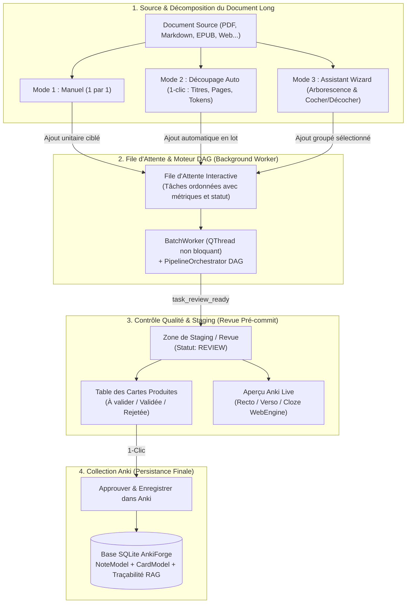

# Plan d'Implémentation : Refonte de la Batch Factory (Atelier de Production & Contrôle Qualité)

## 🎯 Description du Projet & Objectif

La **Batch Factory** actuelle est conçue sous la forme d'un tableau de bord CI/CD rigide (avec console bash simulée), qui enregistre directement les cartes générées en base de données sans étape de revue intermédiaire et gère difficilement le traitement de **documents très longs** (manuels de 50 pages, cours complets, polycopiés).

Lorsque l'utilisateur soumet un document entier d'un bloc, le modèle de langage (LLM) est rapidement submergé : la fenêtre de contexte se dilue, la densité pédagogique s'effondre (10-15 cartes vagues pour un document de 60 pages), et des chapitres entiers sont ignorés.

L'objectif de cette refonte est de transformer la Batch Factory en un véritable **Atelier de Production avec Contrôle Qualité (Staging)** centré sur la décomposition et le traitement optimisé de documents longs :
1. **Résolution du goulot d'étranglement des documents longs** : Proposer **3 modes complémentaires** pour composer la file d'attente à partir d'un document :
   - **Mode Manuel (1 par 1)** : Inspection chirurgicale des sections/titres du document, configuration spécifique par tranche (ex: chapitre 1 vers un sous-paquet précis en modèle basique, chapitre 2 en texte à trous).
   - **Mode Découpage Automatique selon règles (1-clic)** : Partitionnement direct selon des règles paramétrables (par titres H1/H2, par tranches de $N$ pages, ou par blocs de tokens/mots avec découpe douce).
   - **Assistant de Découpage (Wizard interactif)** : Entre-deux visuel permettant de parcourir l'arborescence du document, cocher/décocher les sections utiles (exclure préfaces, annexes, bibliographie) et les envoyer groupées dans la file d'attente avec une configuration partagée.
2. **Zone de Staging / Revue & Prévisualisation des cartes** : Les tâches terminées placent leurs cartes dans un volet de staging où l'utilisateur peut inspecter les cartes produites, vérifier leur rendu Anki en temps réel, retoucher les champs, et les valider/rejeter individuellement ou en bloc avant enregistrement définitif.
3. **Journal d'activité moderne** : Remplacement du faux terminal bash (`root@ankiforge:~/pipeline_logs`) par une timeline d'événements élégante, aérée et filtrable (badges d'erreurs, temps par tâche, alertes de quotas).
4. **Architecture modulaire & maintenable** : Décomposition du fichier monolithique `view.py` (1825 lignes) en composants autonomes typés à 100% (`mypy strict`), respectant scrupuleusement `DESIGN.md` et assurant une rétrocompatibilité intégrale avec les tests existants.



---

## 👥 Spécifications Validées par l'Utilisateur

> [!NOTE]
> **Orientation validée** :
> 1. **Atelier de production avec contrôle qualité** : Revue systématique / staging avant persistance en base.
> 2. **3 modes de composition de la file d'attente** :
>    - Découpage manuel (1 par 1 pour configs différentes).
>    - Découpage automatique selon des règles fixées.
>    - Assistant de découpage (wizard entre-deux interactif).
> 3. **Zone de Staging intégrée** : Volet dédié affichant la table des cartes et l'aperçu Anki live pour la tâche sélectionnée.
> 4. **Modernisation du journal** : Remplacement du faux terminal bash par un journal d'activité/timeline moderne.

---

## 🏗️ Architecture et Découpage des Composants

### 1. Service Métier de Découpage (`src/ankiforge/services/batch/`)

#### `[NEW]` [`slicing_service.py`](file:///Users/tristanrigaud-humbert/PycharmProjects/AnkiForge/src/ankiforge/services/batch/slicing_service.py)
Service métier pur (sans dépendance Qt) pour la segmentation fine des documents longs :
- Dataclass `SliceUnit` :
  - `index: int`
  - `title: str`
  - `heading_path: str`
  - `content: str`
  - `page_number: int | None`
  - `start_page: int | None`
  - `end_page: int | None`
  - `tokens_estimate: int`
  - `words_estimate: int`
- **Stratégie 1 : `slice_by_headings(content, max_depth=2, min_words=50)`** :
  - Découpage CommonMark AST via `MarkdownStructurer`.
  - Injection du fil d'Ariane (`heading_path`) en contexte.
  - Fusion automatique des sous-sections de moins de 50 mots pour éviter les appels IA inutiles.
- **Stratégie 2 : `slice_by_tokens(content, target_tokens=2000, overlap_tokens=150)`** :
  - Découpe par blocs de taille contrôlée (1500 à 2500 tokens).
  - Coupure douce sur les frontières de phrases ou paragraphes (`.\n\n`, `.\n`, `?`, `!`).
  - Recouvrement contextuel de 10-15% pour ne pas tronquer de notion entre deux blocs.
- **Stratégie 3 : `slice_by_pages(content, pages_per_slice=5)`** :
  - Découpage basé sur les marqueurs de page Marker (`{N}-----`) ou PyMuPDF.
- **Méthode d'inspection `get_outline_tree(content)`** :
  - Retourne l'arbre hiérarchique avec titre, niveau, page, tokens pour alimenter l'assistant Wizard.

#### `[MODIFY]` [`models.py`](file:///Users/tristanrigaud-humbert/PycharmProjects/AnkiForge/src/ankiforge/services/batch/models.py)
- Support de l'état de staging dans `BatchTaskSnapshot` :
  - Statuts : `QUEUED`, `RUNNING`, `REVIEW` (prêt pour la revue staging), `ACCEPTED`, `PARTIAL`, `FAILED`, `CANCELLED`, `REJECTED`.
  - Propriétés d'aide : `pending_cards`, `accepted_cards`, `rejected_cards`.
  - Méthodes `set_card_status(card_index, status)`, `update_card_field(card_index, field, value)`.

---

### 2. Dialogues d'Assistance au Découpage (`src/ankiforge/ui/views/batch_view/dialogs/`)

#### `[NEW]` [`auto_slice_config_dialog.py`](file:///Users/tristanrigaud-humbert/PycharmProjects/AnkiForge/src/ankiforge/ui/views/batch_view/dialogs/auto_slice_config_dialog.py)
Boîte de dialogue modale pour lancer le découpage automatique :
- Choix de la règle :
  - 🔘 Par Chapitres (Titres H1/H2) *(Recommandé)*
  - 🔘 Par Blocs de Tokens (Slider : 1 000 à 3 500 tokens)
  - 🔘 Par Tranches de Pages (SpinBox : 1 à 10 pages)
- Prévisualisation instantanée : "Ce document sera scindé en $N$ tâches d'environ $X$ tokens".
- Bouton "Découper et Ajouter à la File".

#### `[NEW]` [`batch_slicing_wizard_dialog.py`](file:///Users/tristanrigaud-humbert/PycharmProjects/AnkiForge/src/ankiforge/ui/views/batch_view/dialogs/batch_slicing_wizard_dialog.py)
Assistant interactif en 3 étapes :
- **Étape 1 : Arbre des Sections** :
  - `QTreeWidget` hiérarchique des chapitres/pages avec cases à cocher.
  - Boutons rapides : `Tout Cocher`, `Tout Décocher`, `Ignorer les intros / index / bibliographies`.
- **Étape 2 : Configuration Partagée** :
  - Paquet Anki cible, Modèle de note, Moteur IA, Pipeline DAG.
- **Étape 3 : Validation du Lot** :
  - Récapitulatif : $X$ tâches sélectionnées, $Y$ tokens estimés, coût prévisionnel.
  - Bouton "Générer les X tâches dans la file d'attente".

---

### 3. Widgets Décomposés de la Batch Factory (`src/ankiforge/ui/views/batch_view/widgets/`)

#### `[NEW]` [`batch_metrics_bar.py`](file:///Users/tristanrigaud-humbert/PycharmProjects/AnkiForge/src/ankiforge/ui/views/batch_view/widgets/batch_metrics_bar.py)
Bandeau supérieur de KPIs :
- Statut Global (En attente, En cours, En revue, Terminé).
- Progression des Tâches ($X$ terminées / $Y$ total).
- Cartes en Staging ($N$ prêtes à valider / $M$ acceptées).
- Temps écoulé / restant et Coût estimé ($).

#### `[NEW]` [`batch_slice_panel.py`](file:///Users/tristanrigaud-humbert/PycharmProjects/AnkiForge/src/ankiforge/ui/views/batch_view/widgets/batch_slice_panel.py)
Volet gauche de composition de la file :
- Sélecteur de document source (`DocumentPickerButton` + métadonnées du document).
- **Contrôle segmenté des 3 modes** :
  - *1 par 1 (Manuel)* : Sélecteur de tranche, réglage de paquet/modèle pour cette tranche, bouton "Ajouter la tranche".
  - *Découpage Auto* : Bouton déclenchant le partitionnement direct selon la règle active.
  - *Assistant Wizard* : Bouton ouvrant l'assistant interactif.
- Cibles Anki par défaut (Paquet, Modèle) & Moteur/Pipeline IA.
- Toggles Vision PDF et Auto-commit (validation automatique sans revue si souhaité).

#### `[NEW]` [`batch_queue_table.py`](file:///Users/tristanrigaud-humbert/PycharmProjects/AnkiForge/src/ankiforge/ui/views/batch_view/widgets/batch_queue_table.py)
Tableau de bord de la file d'attente :
- Colonnes claires : `[x]`, `STATUT` (Badges En attente, En cours, À réviser, Validé, Erreur), `TRANCHE / SOURCE`, `PAQUET`, `MODÈLE`, `PIPELINE`, `PROGRÈS`, `CARTES`, `ACTIONS` (Examiner 👁️, Supprimer ✕, Relancer ↻).
- Barre d'outils avec filtres d'états (`Tous`, `En attente`, `À réviser`, `Terminés`, `Erreurs`).
- Boutons d'action globale : `Démarrer le Traitement`, `Pause / Arrêter`, `Reprendre les échecs`, `Vider la file`.

#### `[NEW]` [`batch_staging_panel.py`](file:///Users/tristanrigaud-humbert/PycharmProjects/AnkiForge/src/ankiforge/ui/views/batch_view/widgets/batch_staging_panel.py)
Volet de Staging / Revue & Prévisualisation :
- Déclenché lors du clic sur une tâche terminée ou au clic sur "Examiner".
- **Volet gauche (Table des Cartes)** :
  - Liste des cartes produites avec statut unitaire (`À valider`, `Validée`, `Rejetée`).
  - Édition directe des champs (Recto / Verso).
  - Actions rapides par carte : Valider (✓), Rejeter (✕).
- **Volet droit (Aperçu Anki Live)** :
  - Moteur `SafeWebEngineView` avec rendu exact du modèle et bascule Recto ↔ Verso.
- **Barre d'actions de Staging** :
  - Bouton `Tout Valider & Enregistrer dans Anki` (persiste atomiquement dans SQLite avec traçabilité RAG).
  - Bouton `Valider la sélection`.
  - Bouton `Rejeter la tranche / Relancer`.

#### `[NEW]` [`batch_activity_log.py`](file:///Users/tristanrigaud-humbert/PycharmProjects/AnkiForge/src/ankiforge/ui/views/batch_view/widgets/batch_activity_log.py)
Journal d'activité moderne remplaçant la console bash verte :
- Timeline fluide d'événements horodatés avec icônes Phosphor (Info, DAG, Succès, Alerte, Erreur).
- Filtres par niveau de log.
- Tiroir rétractable avec mémoire d'état (`_terminal_expanded` pour préserver 100% de la compatibilité des tests).

---

### 4. Vue Coordinatrice Principale (`src/ankiforge/ui/views/batch_view/view.py`)

#### `[MODIFY]` [`view.py`](file:///Users/tristanrigaud-humbert/PycharmProjects/AnkiForge/src/ankiforge/ui/views/batch_view/view.py)
- Intégration harmonieuse des composants au sein de `QSplitter` détachable `IdePanel`.
- Connexion des signaux entre le panneau de découpage, la table de queue, le worker et le panneau de staging.
- Maintien rigoureux de toutes les propriétés et méthodes utilisées par les tests existants :
  - `queue_table`, `docs_list`, `doc_search_input`, `btn_delimit_doc`, `btn_toggle_terminal`, `terminal_content`, `_terminal_expanded`.
  - `refresh_data()`, `_on_add_to_queue_clicked()`, `_on_start_batch()`, `_on_resume_batch()`, `_save_extracted_notes_to_db()`.

---

### 5. Worker d'Exécution en Arrière-Plan (`src/ankiforge/services/workers/batch_worker.py`)

#### `[MODIFY]` [`batch_worker.py`](file:///Users/tristanrigaud-humbert/PycharmProjects/AnkiForge/src/ankiforge/services/workers/batch_worker.py)
- Prise en charge du mode Staging :
  - À la fin de chaque étape de traitement, si `auto_validation` est `False` (mode par défaut), le worker émet `task_review_ready` et marque la tâche en statut `REVIEW`.
  - Si `auto_validation` est `True`, le worker exécute l'enregistrement immédiat et marque `ACCEPTED` (comportement rapide automatique).

---

## 🧪 Plan de Vérification & Tests

### Tests Automatisés

1. **Tests unitaires du service de découpage (`tests/unit/test_slicing_service.py`)** :
   ```bash
   uv run pytest tests/unit/test_slicing_service.py
   ```
   - Validation du découpage sémantique AST Markdown (titres H1, H2, breadcrumbs).
   - Validation du découpage par blocs de tokens avec limites de phrases douces et chevauchement.
   - Validation du découpage par plages de pages.

2. **Tests UI de la Batch Factory et du Staging (`tests/ui/test_batch_views.py`)** :
   ```bash
   uv run pytest tests/ui/test_batch_views.py
   ```
   - Test des 3 modes de composition de la file d'attente (Manuel 1 par 1, Découpage Auto, Assistant Wizard).
   - Test de l'affichage dans la table et des filtres de statut.
   - Test du volet de Staging : inspection des cartes, édition d'un champ, validation, rejet, et acceptation finale en base SQLite.
   - Test de non-régression du tiroir d'activité et de la reprise sur erreur (`_on_resume_batch`).

3. **Validation globale Qualité & Typage Strict** :
   ```bash
   uv run ruff check --fix src/ankiforge/ui/views/batch_view/ src/ankiforge/services/batch/
   uv run ruff format --check src/ankiforge/ui/views/batch_view/ src/ankiforge/services/batch/
   uv run mypy src/ankiforge/ui/views/batch_view/ src/ankiforge/services/batch/
   uv run pytest -m "not slow"
   ```

---

## 📅 Ordre d'Exécution Séquentiel

1. **Étape 1** : Création du service métier `SlicingService` (`src/ankiforge/services/batch/slicing_service.py`) et ses tests unitaires.
2. **Étape 2** : Mise à jour des modèles et du worker (`models.py`, `batch_worker.py`) pour la gestion propre du statut `REVIEW` et des cartes éditables en staging.
3. **Étape 3** : Création des boîtes de dialogue de découpage (`auto_slice_config_dialog.py` et `batch_slicing_wizard_dialog.py`).
4. **Étape 4** : Création des widgets UI modulaires (`batch_metrics_bar.py`, `batch_slice_panel.py`, `batch_queue_table.py`, `batch_staging_panel.py`, `batch_activity_log.py`).
5. **Étape 5** : Refonte de la vue coordinatrice `view.py` intégrant l'ensemble des panneaux avec rétrocompatibilité totale.
6. **Étape 6** : Mise à jour des tests dans `tests/ui/test_batch_views.py`, documentation `DESIGN.md` et `Dossier_architecture/`, puis validation complète de la suite de tests et de la qualité de code.
